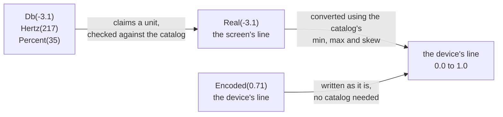

# Everything the library can do

> Purpose: the reference for the protocol layer, grouped by what each call touches.

The [readme](../README.md) is the introduction. This is the reference.

**This page is the protocol layer**, `pyquadcortex.protocol`: one Python call per
Quad Cortex protocol message. Everything on this page is imported from there.

```python
from pyquadcortex import protocol

with protocol.connect() as qc:
    print(qc.version())
```

The other half of the library is the model, at the top level
(`pyquadcortex.connect()`), which represents the unit itself rather than the
messages. It is being built now; its design is in
[domain-model.md](domain-model.md). Use the protocol layer for anything the model
does not cover yet.

`QuadCortex` has over a hundred methods, so they are grouped below by what they
touch. Anything marked global changes the unit rather than a preset. There is
nothing to save and nothing to recall to undo it.

## Contents

- [Method groups](#method-groups)
- [Setting a parameter: the two number lines](#setting-a-parameter-the-two-number-lines)
- [Blocks and the model catalog](#blocks-and-the-model-catalog)
- [Building a chain on an empty row](#building-a-chain-on-an-empty-row)
- [Scenes, and how factory presets build them](#scenes-and-how-factory-presets-build-them)
- [Per-preset tempo and the metronome](#per-preset-tempo-and-the-metronome)
- [Neural Captures](#neural-captures)
- [Settings only your ears can verify](#settings-only-your-ears-can-verify)
- [Reading global settings safely](#reading-global-settings-safely)

## Method groups

Most of these are methods on the object `protocol.connect()` returns. Entries
written `protocol.name(...)` are module-level functions. They take a preset you
already read and need no connection; calling them as methods raises
`AttributeError`.

| | |
|---|---|
| **Connect** | `protocol.connect(profile=, support=)` resolves the unit's device profile before the handshake (ADR-0020) and returns a connected client. An unknown `(device_type, zenos_git_hash)` raises `UnsupportedDevice`. `Support.VERIFIED` (default) refuses an operation the profile has not verified; `Support.EXPERIMENTAL` runs it with one warning. `qc.models`, `qc.params` and `qc.options` are that connection's own constants |
| **Inspect** | `version()`, `list_presets(setlist)`, `find_preset(name, setlist)`, `read_preset(setlist, slot)` |
| **Navigate** | `recall_preset(setlist, slot)`, `switch_scene(scene)` |
| **Edit the grid** | `set_chain_input(row, input)`, `reroute_grid_input(preset, input)`, `set_param(target, param, value)`, `set_bypass(Block(row, column), bypassed)` |
| **Add and remove blocks** | `set_block(Block(row, column, model_id))`, `remove_block(cell)`, `move_block(source, destination)`, `catalog` |
| **Parallel lanes** | `set_split(row, split_column, mix_column)`, `clear_split(row)`, `set_split_mute(row)`, `protocol.splits(preset)` |
| **Route a row** | `set_chain_input(row, input)`, `set_chain_output(row, output)` |
| **Lane output** | `set_param(LaneOutput(row), param, value)`: `VOLUME`, `PAN`, `MUTE`, `SOLO`. `VOLUME` speaks dB, so `Db(-6.0)`. `PAN` reads 50 L through C to 50 R on screen, so `Real(-50.0)` is hard left, `Real(0.0)` is centre and `Real(25.0)` is 25 R |
| **Input gate** | `set_param(LaneInput(row), param, value)`: `NOISE REDUCTION`, `BYPASS`, `INPUT GAIN` |
| **Split and mix** | `set_param(Splitter(row), param, ...)`, `set_param(Mixer(row), param, ...)`, `set_split_mute(row)`, `protocol.splits(preset)` |
| **Footswitches** | `set_stomp_assignment(cell, footswitch)`, `set_stomp_momentary()`, `set_stomp_label()`, `protocol.stomp_assignments(preset)` |
| **Parameter names** | `protocol.params`: a constant per parameter, so `params.LaneOutputParam.VOLUME` replaces `"VOLUME"`. It is its wire index, so it skips the catalog read a name needs, and it carries the parameter's unit in its type so a type checker rejects the wrong one |
| **Expression pedals** | `set_expression(target, param, pedal, minimum, maximum)` and `clear_expression(target, param)`, against any target. `protocol.expression_assignments(preset)` reads back what is assigned |
| **Preset MIDI Out** | `set_midi_out(source, [MidiOut.cc(...)])`, `set_preset_load_midi_out([...])`, `protocol.midi_out(preset)` |
| **Tempo `MODE`** | `tempo_mode()`, `set_tempo_mode(TempoMode.GLOBAL)`: global, and it picks which tempo block plays |
| **Per-preset tempo** | `set_param(Tempo(), name, ...)`, `set_tempo_option(name, n)`, `protocol.tempo_params(preset)`, `set_tempo_led(on)`, `set_metronome_volume(v)` |
| **Metronome** | `set_tempo_subdivision()`, `set_metronome_sound()`, `set_metronome_routing()`, `set_time_signature()`, all taking full enums |
| **Per-beat accents** | `set_beat(n, MetronomeBeat.DOWN)`, `set_beats([...])`, `protocol.beats(preset)` |
| **Inspect a preset** (module functions) | `protocol.blocks(preset)`, `protocol.splits(preset)`, `protocol.free_rows(preset)`, `protocol.row_status(preset)`, `protocol.bypass_state(preset, cell)`, `protocol.param_state(preset, cell, index)`, `protocol.param_options(preset, cell, index)`, `protocol.input_chain_rows(preset, input)`, `protocol.params_equal(a, b, option_count=)`, `protocol.field_present(msg, field)` |
| **Wait for the unit** | `wait_for_listing(setlist, until=...)` |
| **Watch what the unit pushes** | `add_listener(fn)`, `remove_listener(fn)`. Your `fn` is called with every message the unit sends. It runs on the transport's read thread, so it must not block and may not read from the unit. To catch the connect handshake's own burst, register before it with `protocol.connect(before_handshake=...)` |
| **Scenes** | `copy_scene(from_scene, to_scene, swap=False)`, `set_scene_label(scene, label)`, `set_scene_color(scene, argb)` |
| **Global settings** | `settings()`, `update_settings(**fields)`, `set_scene_bypass_behavior()`, `set_global_bypass()`, `set_master_volume_assignment()`, `mode()`, `set_mode()`, `set_mode_cycle()`, `set_gig_view()` |
| **Global EQ** | `global_eq()`, `set_global_eq(band, gain=, frequency=, q=, filter_type=, enabled=)`, `set_global_eq_output(level=, out12=, out34=)`, `set_global_eq_bypassed()` |
| **I/O ports** | `io_settings()`, `set_input_port()`, `set_output_port()`, `set_usb_port()`, `set_midi_thru()`, `set_output_pairing()` |
| **Tuner and Looper** | `tuner()`, `show_tuner()`, `set_tuner_input()`, `set_tuner_reference()`, `set_tuner_mute()`, `looper()` (states named by `LooperState`) |
| **List parameters** | `set_param_option(cell, param, option, source)`, `protocol.param_options(preset, ...)`, including a block's side-chain `SOURCE` |
| **Setlists** | `create_setlist(name)`, `delete_setlist(name)`, `duplicate_setlist(src, dest)`, `list_folders()` |
| **Copying** | `copy_preset(from_setlist, position, to_setlist)`: recall plus save, so it loads each source |
| **Device list** | `pin_model()`, `unpin_model()`, `pinned_models()`, `master_volume()` |
| **Neural Captures** | `captures()` and `list_irs()` to browse the library, `set_capture(cell, entry)` to place one. Creating a capture is the unit's own wizard; disconnect first, since a connected client suppresses it |
| **Preset images** | `QuadCortex41.preset_screenshot(folder_name, position, is_factory=False)` returns the device-rendered PNG; the 4.0.1 profile refuses this unmeasured operation |
| **Discovery** | `list_folders()`: every folder the unit knows, including the factory Captures Library and plugin artist presets; `recents()`, `favorites()`, `add_favorite()`, `remove_favorite()` |
| **Manage presets** | `save_current_preset(setlist, slot, name)`, `delete_preset(setlist, preset)`, `move_preset(setlist, preset, to_slot)`; `preset` may be the exact name or a `ProductData` returned by `list_presets()` |
| **Local backups** | `create_local_backup()` returns the unit's validated portable backup document; serialize it to JSON wherever you keep backups |

**Rows and columns are zero-based, and the unit displays rows 1 to 4.** `row=0`
is the top row on screen and `row=2` is the one labelled 3. An edit to the wrong
row still succeeds and still reads back correctly, so nothing tells you. If the
change is meant to be audible, check which row reaches an output: `out_portid`
values 16 to 18 are internal row-to-row routing, so a lane set to one of those can
be muted without silencing anything. 19 (`MULTIPLE`) is a real destination, and
what factory presets use for the Multi-Out.

Presets live in a setlist (`Setlist.USER` or `Setlist.FACTORY`). Identify one by
name with `find_preset()`, by the slot name shown on the unit (`"28C"`), or by
linear index. Scenes are `Scene.A` through `Scene.H`; inputs, outputs and
instrument tags have readable names (`Input.RETURN_1`, `Output.XLR_1_2`,
`Instrument.BASS`).

Things to know before you script against this:

- **The default connect enumerates folders.** On a populated unit that means
  several hundred `File` pushes. Pass `initial_file_listing=False` to either
  `protocol.connect()` or `pyquadcortex.connect()` to defer them. Listing
  methods still read on demand on a verified profile; an unverified profile
  needs `support=Support.EXPERIMENTAL` for them.
- **Editing goes recall, change, save.** The unit saves whatever is on the grid,
  so an edit means recalling the preset first. [protocol.md](protocol.md) says
  why.
- **Saving may rename.** If the setlist already holds a preset of that name, the
  unit appends a `_N` suffix. Pass `confirm=True` to get back the name it stored.
- **Naming a scene leaves the unit on that scene.** Every `scene=` argument works
  by switching to the scene and writing, because that is what the unit honours.
- **`read_preset` recalls the slot**, so there is no side-effect-free way to
  inspect a stored preset. `read_current_preset()` reads the live grid with no
  side effects.
- **File operations are asynchronous**, and the unit often does not reply, so
  save, delete and move do not raise on a missing reply. Confirm with
  `wait_for_listing()` rather than a fixed sleep; settling time grows with the
  number of changes.
- **Do not count a row's blocks with `len()`.** Every row reports all 8 slots
  whether or not they hold anything. Use `protocol.blocks(preset)`.

## Setting a parameter: the two number lines

Every knob on the unit has two number lines.

The screen shows one. A lane volume runs -40 dB to +12 dB, a drive's `GAIN` runs
0 to 10, a filter's cutoff runs 20 Hz to 20000 Hz. Each knob has its own.

The unit stores the other. Every parameter is kept as a number from 0.0 to 1.0,
the same line for all 3,809 of them.

You say which line your number is on:

```python
from pyquadcortex.protocol import Db, Encoded, Real

qc.set_param(LaneOutput(0), "VOLUME", Real(0.0))      # zero on the SCREEN's line
qc.set_param(LaneOutput(0), "VOLUME", Encoded(0.0))   # zero on the DEVICE's line
```

Those two are opposite ends of the same knob. Zero on the screen's line is 0 dB,
unity. Zero on the unit's line is the bottom of the travel, silence. That is why
a bare `0.0` is refused rather than guessed at.

Which line a value is on also decides whether the catalog is consulted:



So `Encoded` is the only one that works with no unit attached. The other two need
the catalog, and the catalog comes from the unit.

### Naming the unit gets it checked

`Db(-3.1)` means the same as `Real(-3.1)` and adds a claim: this parameter is in
dB. Hand it to one the catalog calls Hz and you get a `TypeError` rather than a
wrong write.

```python
qc.set_param(LaneOutput(0), "VOLUME", Db(-3.1))          # fine
qc.set_param(block, "HPF FREQ", Db(-3.1))                # TypeError: it is in Hz
qc.set_param(block, "HPF FREQ", Hertz(217))              # fine
```

The types are `Db`, `Percent`, `Hertz`, `Milliseconds`, `Seconds`, `Semitones`,
`Cents` and `Bpm`. Use plain `Real` when you do not want the check, or when the
parameter has no unit, like that drive's `GAIN`:

```python
qc.set_param(block, "GAIN", Real(5.0))    # 5 of 0..10, no unit involved
```

### When you need `Encoded`

Rarely. The wire carries more parameters than the catalog describes, so an index
the catalog does not know can only be written on the unit's line:

```python
qc.set_param(block, 21, Encoded(0.5))     # the catalog omits index 21
```

Everywhere else a unit type or `Real` says more.

### The same rule for the settings, with one twist

Every method that writes a value takes a typed one, not just `set_param`. The
twist is that the settings are not catalog models, so the scale has to come from
somewhere else, and for several of them nobody has found it. Three cases:

```python
qc.set_input_level(Input.INPUT_1, Db(24.0))   # measured: -12..+60 dB
qc.set_global_eq(2, gain=Db(-3.0))            # -12..+12 dB
qc.set_master_volume(Encoded(0.30))           # no screen scale is known
qc.set_hold_timing(Milliseconds(800))         # no DEVICE scale exists
```

| case | takes | settings |
|---|---|---|
| a known scale | the unit type, converted | an input port's gain (-12..+60 dB), a Global EQ band's gain (-12..+12 dB). `units.SETTING_SPANS` records the evidence beside each |
| no known scale | `Encoded` only; a `Db` raises `ControlNotDrivable` naming what would have to be measured | output port level, USB level, master volume, Global EQ frequency and Q, the Global EQ output level |
| no unit scale at all | the unit type; `Encoded` is refused | the HOLD threshold (`Milliseconds`), the tuner reference (`Hertz`) |

Selectors are not values: `impedance`, `input_type`, `ground_lift`, `hp_select`,
`dry_wet`, `filter_type` and the mute and bypass flags take an enum or a bool.

## Blocks and the model catalog

A grid cell holds a block. `set_block()` fills an empty cell or replaces an
occupied one, and `remove_block()` clears it:

```python
from pyquadcortex.protocol import models

qc.read_preset(Setlist.FACTORY, "27A")                 # load it onto the grid
qc.set_block(Block(0, 2, models.GuitarOverdrive.CHIEF_DS1))
qc.remove_block(Block(0, 5))
qc.save_current_preset(Setlist.USER, "30A", "My Patch")
```

`pyquadcortex.protocol.models` has constants for the **414 factory blocks** every
unit has, grouped by category. Anything else, purchased plugin models and your own
Neural Captures, has ids that differ per unit, so look those up on the connected
unit through `qc.catalog`:

```python
qc.catalog.find("My Capture").id           # by name
qc.catalog[5005].name                      # 'VCA Comp (M)'
qc.catalog.by_category("Bass Amplifier")   # browse
```

The catalog also knows each block's knobs, on `Model.parameters` (not `.params`,
which is the wire's name), so parameters can be set by name and in their own
units:

```python
comp = qc.catalog[5005]
qc.set_param(Block(0, 1, comp), "THRESHOLD", Db(-20))
```

Prefer names to indices: indices are positional, and not every index is a
visible knob.

### Reading back which pedals are assigned

```python
for one in protocol.expression_assignments(preset):
    print(one.target.describe(), one.param_index, one.pedal,
          one.minimum, one.maximum)
```

The sweep ends come back as `Encoded`, because they are positions of the
parameter being swept and converting them needs the catalog. The model layer does
that and reads in the unit's own words:

```python
for one in device.preset.blocks.pedals:
    print(one)          # <EXP 2 on VOLUME (row 1): Off to 3.2 dB>
```

`grid.pedals` covers every container the reader walks: blocks, lanes, the mixer,
the splitter. `block.pedals` narrows it to one placed block.

Three things to know. **`minimum` above `maximum` reverses the pedal**, which is
how the manual describes inverting a parameter, so the pair is not sorted and
`reversed` is the question to ask. **An end can be the `OFF` detent** rather than
a number: on the level family wire `0.0` is a word on the screen, so a sweep
starting at the heel reports `minimum_is_off` and prints `Off`. **With no unit
attached there is no catalog**, so the sweep stays the wire's 0..1 and
`in_real_units` is false.

Reading only, for now. Assigning through the model is M2.

## Building a chain on an empty row

Blocks and an input are not enough. **The unit never assigns a row's output for
you.** A row given blocks and a physical input keeps its output unset and never
reaches a jack. Point it somewhere yourself:

```python
row = free_rows(preset)[0]           # not just "a row with no blocks" - see below
qc.set_block(Block(row, 0, models.BassAmplifier.AMPED_FLIP_TOP_6464))
qc.set_chain_input(row=row, in_portid=Input.INPUT_2)
qc.set_chain_output(row=row, out_portid=Output.XLR_1_2)   # required, not optional
qc.save_current_preset(Setlist.USER, "30A", "Bass on In 2")
```

**Pick the row with `free_rows()`, not by counting blocks.** When a row branches
into a parallel lane, that lane lives on the row below it, which is often empty
and still spoken for. Building there puts your blocks inside the existing chain's
parallel path. `free_rows()` excludes those rows.

**A block can be refused for want of DSP capacity.** A block that does not fit is
accepted on the wire and then simply is not there. `set_block()` checks the
unit's echo and raises `BlockRefused` when a placement did not take; pass
`verify=False` to send and not wait. There is no way to ask how much headroom is
left, so the answer to a refusal is a cheaper block or one fewer.

**Two controls refuse outright, and the unit is why.** A Lane Output Control's
`MUTE` and `SOLO` can be assigned to an expression pedal on the touchscreen, and
the unit stores that in a field the library reads, but a host write of it is
silently dropped. `set_expression()` and `clear_expression()` raise
`ControlNotDrivable` rather than send a message the unit will ignore. It
subclasses `ValueError`, so an existing `except ValueError` still catches it, and
it carries `control`, `evidence` and `workaround`:

```python
try:
    qc.set_expression(LaneOutput(row), name, pedal=1)
except ControlNotDrivable as refusal:
    print(f"{refusal.control}: do it on the unit. {refusal.workaround}")
```

These are the only two such controls. Every other collection takes an expression
assignment on any parameter, `switch`-typed ones included.

Two things to watch. `Output` values 16 to 18 are internal row-to-row routing
rather than jacks; 19 (`MULTIPLE`) is a real destination, and often the right
answer. And the unit stores whatever id you send without validating it, so a
wrong value is kept rather than rejected and reads back cleanly.

## Scenes, and how factory presets build them

Factory presets often produce their scenes with the **mixer**, not with bypass.
In the factory preset "Darkglass AO900 1" nothing is bypassed in any scene: all eight come from
per-scene `LEVEL A` and `LEVEL B` across two rows, giving four amp paths.

```python
qc.set_param(Mixer(0), params.MixerParam.LEVEL_A, Encoded(0.0), scene=Scene.C)
```

A level of `0.0` is silence, and unity is `UNITY_LEVEL` (0.76923077), which is
what every mixer, splitter and lane level in the factory content sits at when
nothing is attenuated. Their span is -40..+12 dB, which the catalog names as
`MIN_MIXER_DB` and `MAX_MIXER_DB`, so `Db(...)` is taken directly. The helpers
remain for converting without a unit in hand:

```python
from pyquadcortex.protocol import db_to_lane_level, lane_level_db

qc.set_param(LaneOutput(0), params.LaneOutputParam.VOLUME, Db(-6.0))
qc.set_param(LaneOutput(0), params.LaneOutputParam.VOLUME,
             Encoded(db_to_lane_level(-6.0)))                          # the same
lane_level_db(0.76923077)     # 0.0

# A pedal as a volume and mute control: silence at the heel, +3.2 dB at the toe.
# The heel is the Off detent, which sits BELOW the dB scale, so the device's
# own 0.0 is the only thing that names it; the toe is just dB.
qc.set_expression(LaneOutput(0), params.LaneOutputParam.VOLUME, pedal=1,
                  minimum=Encoded(0.0), maximum=Db(3.2))
```

The knob's lowest real value is -39.99 dB. At -40.0 the unit shows `OFF`, which
is wire `0.0`, so for silence write `Encoded(0.0)` rather than the bottom of the
dB scale.

The **splitter** divides a row into two lanes:

```python
qc.set_param(Splitter(0), params.SplitterParam.LEVEL_TO_A, Db(-27.0))
```

Address its parameters by the unified model's names (`TYPE`, `STEREO`,
`BALANCE`, `LEVEL TO A`, `LEVEL TO B`, `FREQUENCY`, `MODE`), whatever
type-specific block the preset reports. A preset also exposes a read-only
`chain.splitter[]` view of the same state; writes there are ignored, so always go
through `set_param(Splitter(row), ...)`. Which parameters apply depends on
`TYPE`: the levels for A/B, `BALANCE` for Balance, `FREQUENCY` and `MODE` for
Crossover.

**Where a row splits is readable** with `splits()`, which reports the columns
where a lane leaves and rejoins. Rows that do not branch are omitted:

```python
for s in splits(preset):
    print(f"row {s.row} branches at {s.split_column}, rejoins at {s.mix_column}")
```

A scene is more than which blocks are bypassed: a parameter can hold a different
value in each one. Name a scene and the library does the rest:

```python
from pyquadcortex.protocol import Scene

qc.read_preset(Setlist.FACTORY, "1A")                 # load it onto the grid

# a different drive level in scene C - naming the scene switches to it,
# promotes the parameter to follow scenes, and writes, in the right order
qc.set_param(Block(0, 3), 0, Encoded(0.4), scene=Scene.C)

# per-scene bypass works the same way
qc.set_bypass(Block(0, 3), bypassed=True, scene=Scene.D)
```

Read what a preset stores per scene with the module-level readers. The proto's
own shape is a trap: its bypass table is addressed positionally, and the `row`
and `column` fields inside it read 0 everywhere.

```python
from pyquadcortex.protocol import bypass_state, param_state

st = bypass_state(preset, Block(0, 3))        # .scene_mode, .scenes (8 bools)
pv = param_state(preset, Block(0, 3), 0)      # .scene_mode, .values
```

## Per-preset tempo and the metronome

Each preset carries its own tempo block, separate from the global tempo. The unit
holds both at once, and the Tempo menu's `MODE` switch picks which one plays:

```python
from pyquadcortex.protocol import TempoMode

qc.tempo_mode()                          # TempoMode.PRESET or TempoMode.GLOBAL
qc.set_tempo_mode(TempoMode.GLOBAL)      # run every preset on the device's tempo
```

`set_tempo_mode` is global: it affects every preset and there is nothing to save,
so read it first if you mean to put it back. It moves neither tempo block. The
setters below write the preset's block, so a value written while `MODE` is
`GLOBAL` is stored and not heard until you switch back.

**A read straight after a write returns the previous value, and "a moment" is
not enough.** `GlobalTempo` does not echo `request_id`, so `tempo_mode()`
returns the next ambient push that carries parameters, which arrives about every
seven seconds and may predate your write. Wait ten seconds, which is what the
hardware suite uses.

The per-preset controls:

```python
qc.set_param(Tempo(), params.TempoParam.TEMPO, Bpm(120))   # 40..240 span
qc.set_tempo_led(False)                 # this preset's TEMPO LED off
qc.set_metronome_muted(True)            # silence the click - the unit's own MUTE
qc.set_param(Tempo(), "TIME SIGNATURE", Encoded(0.1))   # a list index; see options
```

`TEMPO` runs 40..240 bpm. `tempo_bpm()` and `bpm_to_tempo()` convert without a
catalog.

Use `set_metronome_muted` and not the volume to silence a click:
`set_metronome_volume(Db(-60.0))` is quiet but still audible, and it is the
bottom of the knob.

The metronome's list controls have named enums:

```python
from pyquadcortex.protocol import (GlobalEQFilter, MetronomeRouting, MetronomeSound,
                                   TempoSubdivision, TimeSignature)

qc.set_time_signature(TimeSignature.SEVEN_EIGHT_2_3_2)
qc.set_tempo_subdivision(TempoSubdivision.EIGHTH_TRIPLET)
qc.set_metronome_sound(MetronomeSound.COWBELL)
qc.set_metronome_routing(MetronomeRouting.OUT_3_4)
```

### Accenting individual beats

Every beat of the bar carries its own state, the cells on the unit's Tempo page.
There are four, and `MetronomeBeat` names them in the order a cell cycles when you
touch it:

```python
from pyquadcortex.protocol import MetronomeBeat, beats

qc.set_time_signature(TimeSignature.FOUR_FOUR)   # FIRST - see the warning below
qc.set_beat(1, MetronomeBeat.DOWN)               # the big downbeat accent
qc.set_beat(3, MetronomeBeat.MUTE)               # silence beat 3 entirely
qc.set_beats([MetronomeBeat.DOWN, MetronomeBeat.OFF,
              MetronomeBeat.MUTE, MetronomeBeat.ON])   # a whole bar at once

beats(qc.read_current_preset())    # {1: DOWN, 2: OFF, 3: MUTE, 4: ON, ...}
```

**These four words name the accent, not whether the beat sounds.** `OFF` is the
plain click and `MUTE` is the silent one. They are the unit's own names, driven
on the unit 2026-09-14: the screen draws a filled circle (`OFF`), an empty one
(`MUTE`), and a filled one with a dot above (`DOWN`) or below (`ON`).

**Set the time signature first.** Changing it rewrites the beats, because the
unit lays the accent pattern out again for the new bar.

The unit stores 13 beats whatever the signature is, enough for 13/4. `beats()`
reports all 13. Beats past the end are stored and not sounded. How many beats a
compound signature sounds has not been measured.

## Neural Captures

A capture block is an ordinary model. Which capture it plays is a string naming a
library file, so browse the library rather than the catalog. The catalog does not
list captures and does not grow when you save one.

```python
mine = [c for c in qc.captures() if 'My' in c.name or True]
qc.set_capture(row=1, column=0, capture=mine[0])
```

Creating a capture is the unit's own wizard, and a connected client suppresses it.
Disconnect to capture.

## Settings only your ears can verify

Some settings share the worst failure shape this unit offers: the write is
accepted, the read-back agrees exactly with what was written, and the rig is
silent or making a noise it should not. A read confirms the unit stored your
value, not that the rig sounds right. If your automation touches any of these,
hand the final check to a person with ears:

| setting | what read-back cannot see |
|---|---|
| **Any tuner write** (`set_tuner_input`, `set_tuner_mute`) | engages an invisible tuner state. With the mute preference true, the outputs are silent with no on-screen cause. Survives recalls, saves and scene switches. Call `restore_audio()` afterwards; it clears the preference, which is the only host-side release. Both setters warn when a write will leave the rig silent |
| **The metronome's `MUTE`** (tempo parameter 4; `set_metronome_muted`, `set_metronome_running`) | 1.0 is audible and 0.0 is muted, the opposite polarity to the lane `MUTE` of the same name. Whether a click is sounding is not represented anywhere a read reaches, and a lane mute does not silence it |
| **Metronome level** (`set_metronome_volume`) | wire 0.0 is -60 dB, quiet but audible. The value reads back perfectly while the click ticks on |
| **Any preset recall** (`recall_preset`, and `read_preset`, which recalls) | interrupts the audio every time, including a redundant recall of the loaded preset. A verify-by-re-reading loop on `read_preset` stutters a rig on every iteration. `read_current_preset()` has no side effects |

A lane routed to `out_portid` 16 to 18 (internal row-to-row routing) can be
"muted" without silencing anything a jack carries.

## Reading global settings safely

Three behaviours to know before trusting a read-back:

1. **State pushes can be partial.** A push after an `UPDATE` may carry only what
   changed, so a reader must wait for one that holds the field it wants.
2. **A read straight after a write can return the previous value.** Allow a
   settle or re-read before deciding a write was refused.
3. **A nested submessage is replaced wholesale.** Setting one flag of
   `master_volume_assignment` clears the others, so use
   `set_master_volume_assignment()`, which reads and merges.

```python
before = qc.settings()                      # read first if you mean to restore
qc.update_settings(screen_brightness=30)    # sparse: only what you name
qc.update_settings(screen_brightness=before.screen_brightness)
```

Fifteen `GeneralSettings` fields are confirmed writable this way. The exceptions:
`internal_midi_clock_enabled` refuses writes; `dimmed_led_brightness` is capped
just below `led_brightness`, so a high value lands lower; `hold_timing` is an
index into six values (500 to 1000 ms in 100 ms steps), so use
`set_hold_timing(Milliseconds(800))` and `hold_timing_ms()`, which convert and
validate. See `update_settings()`'s docstring for the full list.

`update_settings()` refuses `power_option` and `reset_wifi_networks`. Those are
commands rather than settings, and one of them shuts the unit down.
