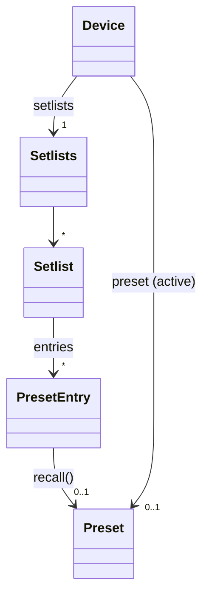
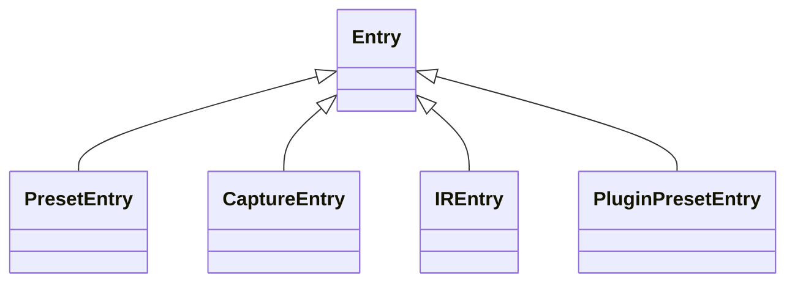
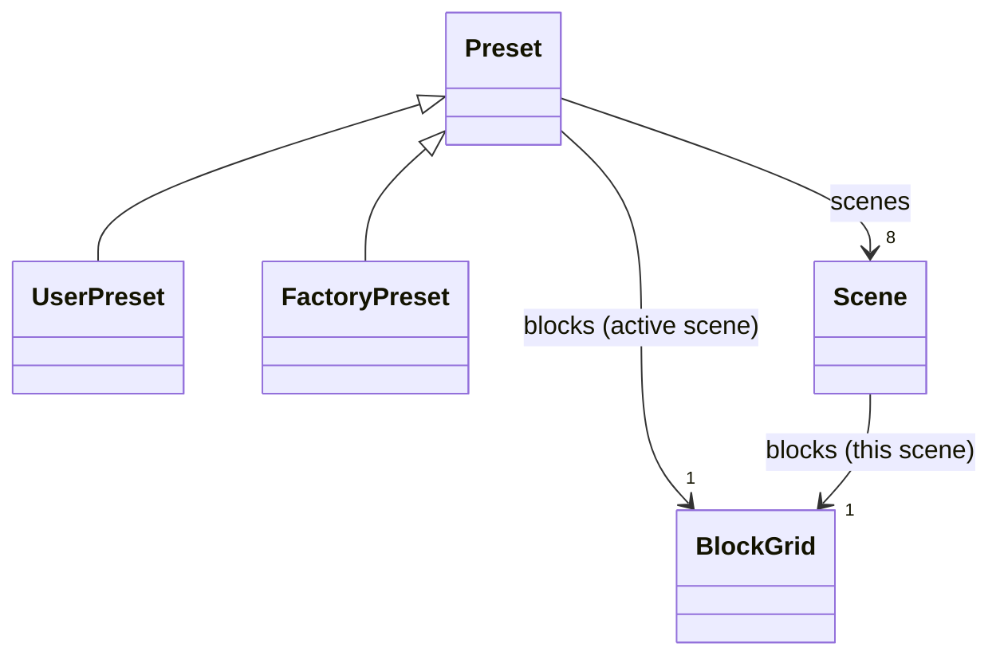
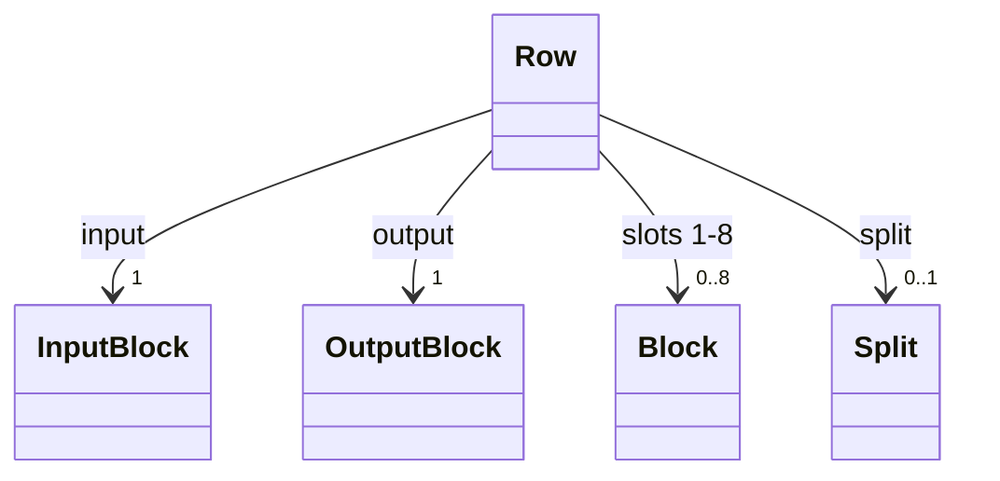
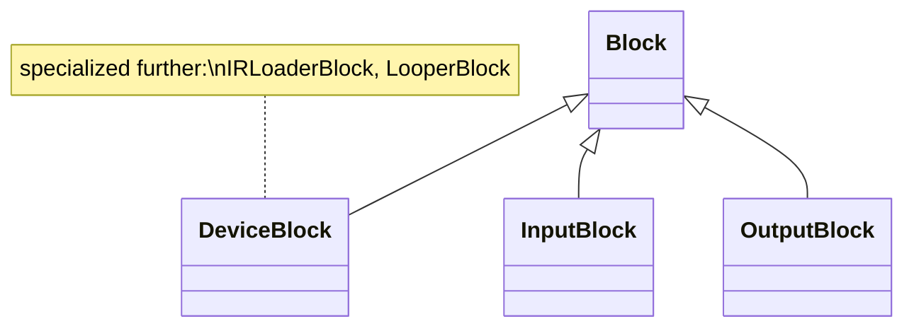
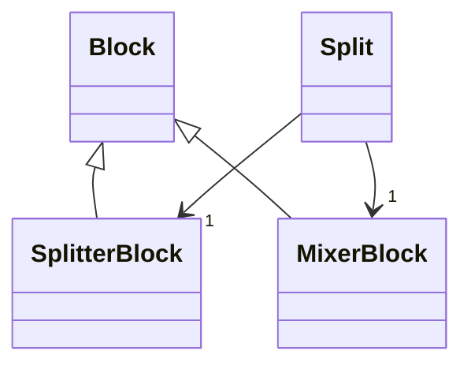
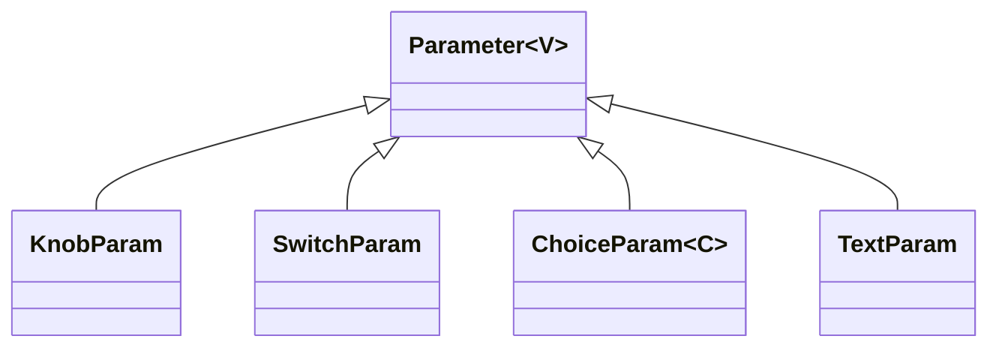

# The domain model

> **Status: M0 design - no code exists yet.** This document is the design for the object
> model of the Quad Cortex that pyquadcortex will expose: a Python API that looks and
> behaves like the unit itself. Part I (this document's bulk) is the structural design -
> the object hierarchy, from the [Quad Cortex manual](https://neuraldsp.com/manual/quad-cortex).
> Part II (state tracking, the save lifecycle, and everything verified on hardware) is
> designed separately and merges here.
>
> The manual is the canonical reference for what the device does and how it presents
> itself. Where this design and the manual disagree, the manual wins; where the manual
> and the touchscreen disagree, the touchscreen wins.

## Design principles

1. **Screen-faithful.** Objects, properties, names, and units match what the unit shows.
   Rows are 1-4 and columns 1-8 as on the touchscreen, scenes are letters, knobs read in
   dB/Hz/ms where the screen shows dB/Hz/ms. A user who knows the unit recognizes the API
   without a mapping table.
2. **Strongly typed, deliberately polymorphic.** Every value has a real type: enums where
   the unit's option set is fixed, domain value types where it is structured, generics to
   carry value types through parameters. Capability differences are type differences - a
   factory preset *has no* `save()` rather than raising when you call it.
3. **Omission over caveat.** If a feature cannot be represented faithfully yet - the wire
   path is unknown, a display mapping is unverified - the model omits it and the appendix
   says why. It stays reachable through the protocol layer. No model API ships with a
   "this might be stale/wrong" caveat.
4. **Nothing audible is a side effect.** Recalling a preset and activating a scene change
   what comes out of the unit's outputs. In the model these are always explicit method
   calls (`entry.recall()`, `scene.activate()`), never a consequence of reading a
   property.
5. **One translation boundary.** The model speaks touchscreen coordinates and display
   units everywhere. Conversion to protocol values (0-based indexes, raw scales) happens
   in exactly one module at the model-to-protocol seam. No `-1`/`+1` anywhere else.

## Namespaces: the model becomes the front door

The model takes the top-level namespace. Today's protocol layer moves to
`pyquadcortex.protocol`, public and supported, with nothing about it changed but the
import path:

```python
import pyquadcortex

with pyquadcortex.connect() as device:          # the model: a Device
    ...

from pyquadcortex import protocol
qc = protocol.connect()                          # today's QuadCortex, unchanged
```

`Device.from_client(qc)` builds a model on an existing protocol connection, so the two
layers mix in one script. The rename lands with M1 (the first model release), so no
release ever has `connect()` meaning two different things. This amends ADR-0004's
"additive namespace" consequence and is recorded as ADR-0006.

---

# Part I - Structure

## 1. Device and the Directory



```python
class Device:
    # identity
    firmware: str                       # e.g. "d14e"
    serial: str

    # the recalled preset (None only before the first recall ever)
    preset: Preset | None
    def recall(self, target: PresetEntry | Slot | str) -> Preset: ...   # "28C" works

    # the Directory
    setlists: Setlists                  # setlists["My Presets"], .factory, .user
    favorites: Sequence[PresetEntry]
    recents: Sequence[PresetEntry]
    captures: Library[CaptureEntry]
    irs: Library[IREntry]

    # the Virtual Device List
    catalog: Catalog

    # device-level features (section 6)
    io: IO
    global_eq: GlobalEQ
    tuner: Tuner
    tempo: Tempo
    modes: Modes
    settings: Settings
    master_volume: MasterVolume
    gig_view: bool                      # open/close Gig View
```

`Setlists` covers every preset container the Directory shows: `Factory Presets` and
`My Presets` (non-deletable, exposed as `.factory` and `.user`), plus user setlists,
which are created and deleted through the model (`setlists.create(name)`,
`setlist.delete()`, `setlist.rename(name)` - M3 lifecycle). The manual's limits (10 user
setlists, 256 presets each, 3072 total) are the device's to enforce; the model reports
the device's refusal rather than pre-checking.

```python
class Setlist:
    name: str
    def __getitem__(self, slot: Slot | str) -> PresetEntry: ...   # setlist["28C"]
    def __iter__(self) -> Iterator[PresetEntry]: ...
    def find(self, name: str) -> PresetEntry | None: ...

class Slot:
    """A preset's address as the Directory shows it: bank number + position letter."""
    bank: int
    position: str                       # "A".."H"
    # str() gives "28C"; parsing accepts the same form
```

> The manual is internally inconsistent about bank size: chapter 3 says banks of eight,
> chapter 5 says four (two in a PRESET-containing HYBRID mode). `Slot` therefore models
> the *address* ("28C") and takes no position on how many presets share a bank; the
> Directory's own addressing is what the protocol layer confirmed. Flagged for hardware
> observation in Part II.

### Directory entries are a type family

Everything a Directory list can hold shares an `Entry` base; what you can *do* to an
entry is expressed by its type. This is how read-only-ness works throughout the model:
factory content lacks mutating methods entirely, so misuse is a type error, not a
runtime surprise.



```python
class Entry:
    name: str

class PresetEntry(Entry):               # what the Directory's preset rows show
    slot: Slot
    setlist: Setlist
    instrument: Instrument              # Guitar / Bass / Synth / Vocal / Other
    favorite: bool                      # settable; only presets can be favorited
    def recall(self) -> Preset: ...     # audible - loads the preset on the unit

class UserPresetEntry(PresetEntry):
    def rename(self, name: str) -> None: ...
    def move_to(self, slot: Slot) -> None: ...          # same-setlist confirmed so far
    def copy_to(self, setlist: Setlist, slot: Slot | None = None) -> UserPresetEntry: ...
    def delete(self) -> None: ...

class FactoryPresetEntry(PresetEntry):
    ...                                 # no mutating methods AT ALL

class CaptureEntry(Entry): ...          # place with row.place(col, capture)
class IREntry(Entry): ...               # assign to an IR Loader slot
class PluginPresetEntry(Entry): ...     # listing only; see appendix
```

`Library[E]` is the read side of the Captures and IR libraries: iteration, `find()`,
and typed entries. Library *management* (folders, rename, delete) has no known wire
path and is omitted for now - see the appendix. `recall()` returns a `UserPreset` or
`FactoryPreset` matching the entry's type, so the capability split carries through.

## 2. Preset and Scenes



```python
class Preset:
    name: str
    slot: Slot
    instrument: Instrument
    has_unsaved_changes: bool           # the italic name on screen (mechanics: Part II)

    scenes: Scenes                      # scenes["B"], scenes.active, iteration
    rows: Rows                          # rows[1] .. rows[4]
    blocks: BlockGrid                   # blocks[1, 3] - bound to the ACTIVE scene

    def save_as(self, name: str, *, setlist: Setlist | None = None,
                instrument: Instrument | None = None,
                default_scene: SceneLetter | None = None) -> UserPresetEntry: ...

class UserPreset(Preset):
    def save(self) -> None: ...         # persist in place

class FactoryPreset(Preset):
    ...                                 # editable live, but only save_as() persists

class Scene:
    letter: SceneLetter                 # "A".."H"
    name: str                           # editable, as in Gig View's EDIT SCENE
    blocks: BlockGrid                   # bound to THIS scene
    def activate(self) -> None: ...     # audible - explicit, like recall
```

**The scene/grid duality.** Blocks are placed once per preset; bypass state and
scene-following parameter values vary per scene. There is exactly one `Block` object
per occupied cell, and a `BlockGrid` is a *binding* of the grid to a scene context:

- `preset.blocks` is **live-bound**: it always reads and writes through whatever scene
  is currently active, like the touchscreen itself.
- `scene.blocks` is **fixed-bound** to that scene.

Scene-invariant facts (which device is placed, its position, its non-scene parameters)
are identical through every binding; scene-varying state differs. The two paths cannot
disagree because the object underneath is the same.

Writing through a *non-active* scene's binding is supported only where the protocol
layer confirms the wire allows it (per-scene bypass does). Anything unconfirmed stays
active-scene-only until Part II's hardware work answers it - the model never guesses.

The default scene (the one a preset opens in) follows the unit's own rule: it is set by
saving while that scene is active, surfaced as the `default_scene` argument on the save
methods. Scene *copy* and *swap* (Gig View operations) have no audited wire path yet and
are omitted - see the appendix.

## 3. Rows and blocks



```python
class Row:
    number: int                          # 1..4, as on screen
    input: InputBlock
    output: OutputBlock
    def __getitem__(self, column: int) -> Block | None: ...   # row[3], 1..8
    def place(self, column: int, model: CatalogModel | CaptureEntry) -> DeviceBlock: ...
    split: Split | None
    def create_split(self, at: int, rejoin_at: int) -> Split: ...
    def clear_split(self) -> None: ...
```

The block family mirrors what the grid can show:





```python
class Block:
    row: int
    column: int                          # 1..8; input/output blocks sit outside 1-8

class DeviceBlock(Block):                # a placed virtual device
    model: CatalogModel
    bypassed: bool                       # per scene, via the binding
    params: Params                       # params["GAIN"] -> Parameter (section 5)
    stomp: StompAssignment | None        # section 7
    expression_bypass: ExpressionBypass | None
    def remove(self) -> None: ...
    def move_to(self, row: int, column: int) -> None: ...   # cross-row = branch
    def replace(self, model: CatalogModel) -> DeviceBlock: ...

class IRLoaderBlock(DeviceBlock):
    slots: tuple[IRSlot, IRSlot]         # slot.ir = an IREntry, by library key

class LooperBlock(DeviceBlock):
    state: LooperState                   # read-only: five states incl. OVERDUBBING
    # transport actions are NOT drivable over USB; MIDI CC#48-61 is the documented
    # route - see the appendix

class InputBlock(Block):
    source: InputSource                  # which physical input feeds this row
    gate: InputGate                      # NOISE REDUCTION / BYPASS / INPUT GAIN, per scene

class OutputBlock(Block):
    destination: OutputDestination       # physical out, send, USB, another row, Multi-Out
    lane: LaneOutput | None              # VOLUME/PAN/MUTE/SOLO, per scene;
                                         # None when routed to another row (as on screen)

class SplitterBlock(Block):
    params: Params                       # TYPE, STEREO, BALANCE, LEVEL TO A/B, FREQUENCY, MODE

class MixerBlock(Block):
    params: Params                       # LEVEL A/B, PAN A/B, PHASE, MIXER LEVEL

class Split:
    """A row pair's parallel path: the (S) and (M) tokens and the lane between them."""
    splitter: SplitterBlock
    mixer: MixerBlock
    muted: bool          # ONE control on the unit; the wire confirms it is shared
```

Placement rules are the device's: a refused placement (DSP capacity) raises
`CapacityError` - *detected*, not predicted, because the wire offers no headroom read.
A cross-row `move_to` creates a branch, exactly as dragging does on the touchscreen.
Side-chain SOURCE/TRIGGER is an ordinary `ChoiceParam` on the blocks that have it.

## 4. Parameters



```python
class Parameter(Generic[V]):
    name: str                            # the label on screen
    value: V                             # typed get AND set
    follows_scenes: bool                 # settable: promote/demote (tap-and-hold on screen)
    expression: ExpressionAssignment | None      # section 7

class KnobParam(Parameter[float]):
    unit: str                            # "dB", "Hz", "ms", "%", ""
    range: Range                         # min/max as displayed

class SwitchParam(Parameter[bool]): ...

class TextParam(Parameter[str]): ...     # e.g. a Cab's microphone name field

class ChoiceParam(Parameter[C]):         # dropdowns
    options: Sequence[C]
```

**Values are what the screen shows.** A knob that displays -6.0 dB reads and writes
`-6.0`. The raw wire scale (0..1 with unity at 0.769, and friends) is the translation
boundary's problem. A parameter whose display mapping is *unverified* is omitted from
the model until verified, per principle 3.

**Choice types.** Where the unit's option set is fixed, `C` is a real enum
(`ChoiceParam[TimeSignature]`, `ChoiceParam[FilterType]`). Where the option list is
dynamic but *structured* - routing sources whose membership grows with the preset
("Follow Input", "Input 1", "Return 2", "USB Input 5"...) - `C` is a domain value type
(`Source`) parsed from the device's own option list, dynamic in membership but fixed in
type. Only genuinely free-form lists fall back to `str`. Option names always come from
the preset's own `dynamic_steps`, so they match the screen exactly.

## 5. The catalog

```python
class Catalog:
    categories: Sequence[Category]       # AMP, CAB, DELAY ... as the Virtual Device List
    def find(self, name: str) -> CatalogModel | None: ...
    pinned: Sequence[CatalogModel]
    def pin(self, model: CatalogModel) / unpin(...): ...

class CatalogModel:
    name: str
    category: Category
    stereo: bool
    sidechain: bool                      # the (S/C) marker
```

The catalog is the device's own model repository, so it reflects purchased and captured
content. Plugin-locked devices appear with their plugin marker, matching the list on
screen.

## 6. Device-level features

Each feature object mirrors one screen or menu on the unit.

```python
class IO:                                # the I/O Settings menu (swipe down)
    inputs: Mapping[str, InputPort]      # "INPUT 1", "INPUT 2"
    returns: Mapping[str, ReturnPort]
    outputs: Mapping[str, OutputPort]    # "OUT 1/L" .. "OUT 4/R", sends
    usb: USBPorts

class InputPort:
    level_db: float
    impedance: Impedance                 # enum; disabled in Mic type, as on screen
    input_type: InputType                # Instrument / Mic
    # PHANTOM 48V: omitted - no field exists in the schema (appendix)

class OutputPort:
    level_db: float
    ground_lift: bool
    muted: bool
class OutputPair:
    linked: bool                         # OUTPUT PAIRING; paired outs share values

class USBPorts:
    level: float
    hp_source: HPSource                  # enum
    dry_wet: DryWet                      # enum: DI vs processed on outs 1/2, 3/4

class GlobalEQ:
    bypassed: bool
    bands: Sequence[EQBand]              # 5 bands
    outputs: EQOutputAssignment          # out 1/2, out 3/4
    auto_disabled: bool                  # read-only: the unit sheds it under DSP pressure
class EQBand:
    filter_type: FilterType
    gain_db: float                       # -12..+12
    frequency_hz: float                  # 20..20k
    q: float
    enabled: bool
    # the OUT tab's overall LEVEL: omitted - dB mapping unverified (appendix)

class Tuner:
    visible: bool                        # show/hide the Tuner menu
    reference_hz: float                  # displayed absolute Hz (wire stores the offset)
    source: TunerSource                  # inputs, returns, INPUT_1_2, USB 5/6
    muted: bool
    # LIVE TUNER (the streaming needle): omitted by decision (appendix)

class Tempo:                             # the Tempo & Metronome menu
    bpm: float
    led: bool
    metronome: Metronome
    # MODE (Global vs Preset): omitted - not on the wire at all (appendix)
class Metronome:
    playing: bool
    volume: float
    pan: float
    time_signature: TimeSignature
    subdivision: Subdivision
    sound: MetronomeSound
    routing: MetronomeRouting

class Modes:
    active: ModeSlot                     # what the top-right corner shows
    cycle: Sequence[ModeSlot]            # reorder / merge / remove via set_cycle
    def set_active(self, slot: ModeSlot) -> None: ...
    def set_cycle(self, slots: Sequence[ModeSlot]) -> None: ...
# ModeSlot = Mode | HybridMode; Mode is PRESET/SCENE/STOMP,
# HybridMode(top=..., bottom=...) models all six ordered pairings.
# A cycle holds at most one hybrid and a hybrid cannot be the only slot -
# the device's own rules, enforced by the device; the model surfaces its refusal.

class MasterVolume:
    level: float                         # 0-100 as displayed; READ-ONLY (the wire cannot
                                         # write it - it is a separate gain stage)
    outputs: set[OutputAssignment]       # the overlay's checkboxes
    per_output: bool                     # knob function: global vs output-specific

class Settings:                          # the Device Settings menu, eponymous rows
    global_bypass: GlobalBypass          # Cab / IR Loader, four rows each
    scene_bypass_behavior: SceneBypassBehavior   # enum, three modes
    stomp_mode_auto_assign: bool
    hold_timing_ms: int                  # 500-1000 in 100 ms steps, as on screen
    swap_tempo_and_tuner: bool
    gig_view_access: bool
    latency_compensation: bool
    midi: MidiSettings                   # channel, thru, over USB, ignore dup PC, clock in/out
    brightness: Brightness               # screen, LED, dimmed LED (quantized by the unit)
    storage: Storage                     # read-only: presets/captures/IRs disk usage
```

## 7. Assignments and Preset MIDI Out

```python
class StompAssignment:                   # footswitches A-H in Stomp mode, per preset
    footswitch: FootswitchLetter         # "A".."H"
    targets: Sequence[DeviceBlock]       # one switch can toggle several blocks
    label: str                           # EDIT STOMP's custom name
    momentary: bool

class Stomps:                            # preset.stomps
    def __getitem__(self, footswitch: str) -> StompAssignment | None: ...
    def assign(self, footswitch: str, block: DeviceBlock, *, momentary: bool = False,
               label: str | None = None) -> StompAssignment: ...
    def clear(self, footswitch: str) -> None: ...

class ExpressionAssignment:              # assigned FROM the parameter, as on screen
    pedal: ExpressionPedal               # EXP 1 / EXP 2
    minimum: float                       # MIN RANGE, in the parameter's own units
    maximum: float                       # MAX RANGE; min>max reverses, as documented

class ExpressionBypass:
    mode: ExpressionBypassMode           # HEEL_TOE / SWITCH / STOP
    # INVERT RANGE, SWITCH DELAY, LATCH EMULATION: unaudited wire path - omitted
    # until verified (appendix)

class PresetMidiOut:                     # preset.midi_out - the Preset MIDI Out menu
    on_load: Sequence[MidiMessage]
    footswitches: Mapping[FootswitchLetter, Sequence[MidiMessage]]
    expression: Mapping[ExpressionPedal, Sequence[MidiMessage]]
# MidiMessage is a small typed union: ControlChange / ControlChangeToggle / ProgramChange
```

Expression-assigned parameters are excluded from scene data (the unit's rule); the model
reflects that: assigning an expression pedal to a parameter fixes `follows_scenes` off,
matching the screen's behavior.

## 8. Errors

- `CapacityError` - the device refused a placement or move (DSP headroom). Detected, not
  predicted.
- `NotConnectedError` - the device went away; Part II defines detection and cache
  consequences.
- Static prevention beats runtime errors everywhere types can carry the rule: factory
  types lack mutating methods, enums bound choice values, `Slot` rejects malformed
  addresses at parse time.

The device accepts-and-ignores writes it does not understand, so the model's contract
is: **every mutating call either verifies acceptance or is backed by a
hardware-confirmed protocol method**. The mechanics (read-backs, echoes, timeouts) are
Part II's subject.

---

# Part II - Behavior (designed separately)

State tracking (the write-through cache, broadcast subscriptions, proactive reads,
reconnect invalidation), the save lifecycle (recall-edit-save internalized,
`has_unsaved_changes` mechanics, abandon-on-switch), and the hardware-verified broadcast
inventory land here from the companion design story. Its empirical questions are
tracked in that story; rows marked *Part II* in the appendix depend on its findings.

---

# Appendix - manual feature audit

Every feature the manual describes, mapped to the model or explicitly omitted.
**Protocol** is the current reachability from [`manual-coverage.md`](manual-coverage.md)
(*yes* / *partly* / *no* / *n/a*); *unaudited* marks features this design pass found
missing from that audit. An omission with a protocol path of *no* becomes reachable
work only after the protocol layer grows the path - closing wire gaps is separate work.

Manual chapters 1-2 (welcome, hardware overview), 7 (plugin compatibility tables), 9's
host-side audio setup, and 12 (specs, regulatory) describe physical hardware, host
concerns, or reference text with nothing for a host API to model; they are covered by
the n/a rows below where they intersect the API at all.

## Chapter 3 - Global controls, quick start

| Manual feature | Model surface | Protocol | Notes |
|---|---|---|---|
| Power on/off, reboot, Be Right Back, lock | - | n/a | physical power button; the wire refuses `power_option` as a command |
| Master Volume level | `device.master_volume.level` (read-only) | partly | the wire cannot write it; nearest writable equivalent is output levels |
| Master Volume output assignment | `device.master_volume.outputs` | yes | |
| Master Volume knob function | `device.master_volume.per_output` | yes | |
| Footswitch presses, touch gestures, encoders | - | n/a | physical controls |
| Recall a preset | `entry.recall()`, `device.recall("28C")` | yes | |
| Bank navigation / Blinking Mode | `Slot` addressing covers the destination | yes | Blinking Mode itself is a footswitch UI flow, n/a |
| Tuner menu open/close | `device.tuner.visible` | partly | accepted on the wire; on-screen effect not yet eyeballed |
| Tuner reference pitch | `device.tuner.reference_hz` | yes | displayed Hz; wire stores offset from 440 |
| Tuner input source | `device.tuner.source` | yes | `RETURN_1_2` refused by the device itself |
| Tuner mute | `device.tuner.muted` | yes | |
| Live Tuner (streaming needle) | **omitted** | no | the device refuses `enable_meter` from a host; unsupported by decision |
| Tempo (BPM) | `device.tempo.bpm` | yes | |
| Tempo MODE (Global vs Preset) | **omitted** | no | broadcasts nothing, even on commit - not on the wire at all |
| Tap tempo | **omitted** | no | `GlobalTempo` read returns only a running clock; MIDI CC#44 is the documented route |
| Tempo LED | `device.tempo.led` | yes | |
| Metronome volume/playback/pan/T-sig/subdivisions/sound/routing | `device.tempo.metronome.*` | yes | full enums for all four option lists |
| Per-scene tempo (Cortex Control's bottom bar claims it) | **omitted** | n/a | the unit has no per-scene tempo; `scene_tempo` is inert on the wire. On-unit presentation wins |
| Modes: read/set active | `device.modes.active` | yes | |
| Modes: reorder / merge to HYBRID / remove | `device.modes.set_cycle()` | yes | all six ordered hybrid pairings modeled; device enforces its own cycle rules |
| PRESET / SCENE / STOMP mode semantics | covered by `Slot`, `Scene`, `Stomps` | yes | the modes are footswitch behavior; their objects are modeled where state lives |
| Scene recall | `scene.activate()` | yes | |
| Scene assignment of a parameter (tap-and-hold) | `param.follows_scenes` | yes | flag must travel alone on the wire - absorbed |
| Default scene on save | `default_scene=` on save methods | yes | set by saving in that scene, as on the unit |
| Scenes dropdown | `preset.scenes` | yes | |
| Stomp assignment (see ch. 4) | `preset.stomps` | yes | |
| Gig View open/close | `device.gig_view` | yes | |
| Gig View EDIT SCENE (name, color) | `scene.name`; color **omitted** | unaudited | scene name/color writes not in the coverage audit; verify in Part II |
| Gig View SWAP SCENE / COPY SCENE | **omitted** | unaudited | no audited wire path; candidate for Part II observation |
| Gig View EDIT STOMP | `stomp.label`, `stomp.targets` | yes | |
| I/O: input LEVEL / IMPEDANCE / TYPE | `io.inputs[...]` | yes | fields travel one per message - absorbed |
| I/O: PHANTOM 48V | **omitted** | no | no field exists in the recovered schema |
| I/O: output LEVEL / GROUND LIFT / MUTE | `io.outputs[...]` | yes | mute travels alone - absorbed |
| I/O: output pairing | `OutputPair.linked` | yes | |
| I/O: USB LEVEL / HP SOURCE / DRY-WET | `io.usb` | yes | headphone output's own level is not writable anywhere |
| Global EQ: bypass, 5 bands, output assignment | `device.global_eq` | yes | whole 28-index layout mapped |
| Global EQ: OUT tab overall level | **omitted** | partly | control reachable but its dB mapping is unverified - omission over caveat |

## Chapter 4 - The Grid

| Manual feature | Model surface | Protocol | Notes |
|---|---|---|---|
| Grid layout: 4 rows x 8 slots | `preset.rows`, `preset.blocks[r, c]` | yes | 1-based, as on screen |
| Virtual Device List: browse by category | `device.catalog` | yes | the device's own repository |
| Virtual Device List: search | client-side over `catalog` | n/a | iteration makes it a Python expression |
| Pin/unpin a device | `catalog.pin()/unpin()`, `catalog.pinned` | yes | append-not-replace quirk absorbed |
| Place / replace a block | `row.place()`, `block.replace()` | yes | acceptance verified by the model |
| Remove a block | `block.remove()` | yes | |
| Move a block (drag) | `block.move_to()` | yes | cross-row move creates a branch, as on screen |
| DSP capacity refusal | `CapacityError` | partly | detected not predicted; no headroom read exists |
| CPU Monitor | **omitted** | no | `CPULoad` never arrives on the wire |
| Global EQ / Input Gate auto-disable under load | `global_eq.auto_disabled` (and gate equivalent) | partly | `CompilerInhibitedModules` arrives on grid edits; surfacing it is new API |
| Input blocks: assign input source | `row.input.source` | yes | |
| Input Gate Control | `row.input.gate` | yes | per scene; GAIN REDUCTION is a meter, n/a |
| Output blocks: assign destination | `row.output.destination` | yes | rows, sends, USB, Multi-Out |
| Lane Output Control | `row.output.lane` | yes | absent when routed to another row, as on screen |
| Block bypass | `block.bypassed` | yes | per scene via the binding |
| Parameter knobs / dropdowns / switches | `KnobParam` / `ChoiceParam` / `SwitchParam` | yes | display units; options from the preset's own lists |
| Special parameters (Cabs, Looper X full-screen editors) | same `Params` surface | yes | text-valued ones are `TextParam` |
| Side-chain SOURCE/TRIGGER | a `ChoiceParam[Source]` on (S/C) blocks | yes | ordinary parameter on the wire too |
| Splitter & Mixer: create / activate | `row.create_split()` | yes | |
| Splitter parameters (TYPE/STEREO/BALANCE/LEVELS/FREQ/MODE) | `split.splitter.params` | yes | |
| Mixer parameters (LEVELS/PANS/PHASE/MIXER LEVEL) | `split.mixer.params` | yes | |
| Splitter/Mixer MUTE | `split.muted` | yes | one shared control - the wire confirms it |
| Where a row branches and rejoins | `row.split`, branch topology on `Row` | yes | |
| Footswitch (Stomp) assignment | `preset.stomps` | yes | multiple blocks per switch modeled |
| Stomp momentary + label | `stomp.momentary`, `stomp.label` | yes | |
| Expression pedal assignment (MIN/MAX, reverse) | `param.expression` | yes | reversal by min>max, as documented |
| Expression bypass: three modes | `block.expression_bypass.mode` | yes | wire order differs from the manual's listing - absorbed |
| Expression bypass: INVERT RANGE / SWITCH DELAY / LATCH EMULATION | **omitted** | unaudited | not in the coverage audit; verify in Part II |
| Expression pedal calibration | **omitted** | no | global setting; candidate `IOSettings`, unexplored |
| Set Parameters as Defaults | **omitted** | no | `DefaultParameters` decoded, never written |
| Looper X: place the block | `row.place()` - ordinary catalog model | yes | |
| Looper X: parameters | `LooperBlock.params` | yes | |
| Looper X: transport actions | **omitted**; `LooperBlock.state` is readable | partly | transport is not drivable over USB; MIDI CC#48-61 is the documented route |
| Undo / redo | **omitted** | no | `UndoRedo` arrives as an acceptance signal only; never driven |

## Chapter 5 - The Directory

| Manual feature | Model surface | Protocol | Notes |
|---|---|---|---|
| Directory navigation, categories | `device.setlists` / `.captures` / `.irs` | yes | |
| Favorites | `device.favorites`, `entry.favorite` | yes | presets only, as on the unit |
| Recents | `device.recents` | yes | |
| Factory / My Presets setlists | `setlists.factory` / `.user` | yes | non-deletable, so no `delete()` on them |
| User setlists: create / rename / delete | `setlists.create()`, `setlist.rename()/.delete()` | yes | |
| Banks | `Slot` | yes | manual self-contradicts on bank size (8 vs 4); flagged for Part II |
| Downloads / Cloud Presets categories | listing only, if discoverable | no | cloud surfaces are out of scope without owner permission |
| Save (in place) | `UserPreset.save()` | yes | |
| Save As | `preset.save_as()` | yes | works from factory presets, as on the unit |
| Unsaved-changes indicator (italic name) | `preset.has_unsaved_changes` | partly | display rule is clear; detection mechanics are Part II |
| Preset descriptive tags | **omitted** | n/a | no save path preserves them - the unit's own Save As strips them |
| Preset description / author / cloud id | **omitted** | no | writes ignored; author stamped by the device from the signed-in account |
| Preset volume and pan fields | **omitted** | n/a | inert fields; the unit has no control for them |
| Move a preset | `entry.move_to()` | yes | same-setlist observed so far |
| Copy / duplicate a preset | `entry.copy_to()` | partly | recall-and-save under the hood, seconds per preset; the model says so in its docs |
| Delete a preset | `entry.delete()` | yes | eventually consistent on the wire - absorbed |
| Bulk actions (multi-select) | Python iteration over entries | partly | no host-drivable bulk op; per-item calls; `duplicate_setlist()` composes |
| Sorting | client-side | n/a | |
| Search (incl. recent searches) | client-side over listings | no | on-wire search unexplored (`RecentSearches`) |
| Filtering captures by category | client-side over `captures` | n/a | |
| Neural Captures: list | `device.captures` | yes | Factory V1/V2 and My Captures |
| Load a capture onto the grid | `row.place(col, capture)` | yes | |
| Captures: rename / delete / manage | **omitted** | no | candidate `File`, unexplored |
| Capture/IR folders, subfolders, saving destination | **omitted** (flat listing) | no | folder management unexplored |
| IRs: list | `device.irs` | yes | plugin-asset IRs excluded - the unit cannot load them |
| IRs: load into an IR Loader | `IRLoaderBlock.slots[n].ir` | yes | two slots; keyed by library id, name travels separately - absorbed |
| Plugin Presets folders | `PluginPresetEntry` listing only | no | candidates `License`/`CloudProduct` |
| Upload to Cortex Cloud | **omitted** | no | cloud surface; owner permission required |

## Chapter 6 - Neural Capture

| Manual feature | Model surface | Protocol | Notes |
|---|---|---|---|
| Run a capture (v1 wizard) | **omitted** | no | the unit hands the flow to a connected host, suppressing the on-device wizard - a hazard, not a feature, until fully understood |
| Capture v2 (via Cortex Control + cloud) | **omitted** | no | flow unexplored; also a cloud surface |
| Calibration / A-B test / metadata | **omitted** | no | |
| Physical connection for capture | - | n/a | cabling |

## Chapter 8 - MIDI

| Manual feature | Model surface | Protocol | Notes |
|---|---|---|---|
| Controlling the unit over MIDI (PC, CC#0-62) | - | n/a | this library speaks USB HID; the MIDI map is the manual's ch. 8 |
| MIDI settings: channel / Thru / over USB / ignore dup PC / clock | `device.settings.midi` | partly | all confirmed writable except `internal_midi_clock_enabled`, which refuses writes - that one field is omitted |
| Preset MIDI Out: footswitch / expression / on-load | `preset.midi_out` | yes | CC, CC Toggle, and PC message types modeled |

## Chapter 10 - Device Settings menu

| Manual feature | Model surface | Protocol | Notes |
|---|---|---|---|
| Account settings, cloud backups | **omitted** | no | cloud surface; owner permission required |
| Wi-Fi / connectivity | **omitted** | no | unexplored |
| CorOS updates | **omitted** - permanently | no | the `Updater` surface is out of scope for good (see STEERING) |
| Screen / LED / dimmed-LED brightness | `settings.brightness` | yes | unit quantizes; dimmed stays below LED - device rules, reported as read back |
| Power button sensitivity | **omitted** | no | refused as a command by the wire |
| Master Volume knob function | `master_volume.per_output` | yes | also in ch. 3 |
| Device storage info | `settings.storage` | yes | read-only |
| Factory reset | **omitted** - permanently | n/a | destructive; not a host operation |
| GLOBAL BYPASS (Cab / IR per row) | `settings.global_bypass` | yes | |
| SCENE BYPASS BEHAVIOR (3 modes) | `settings.scene_bypass_behavior` | yes | changes what bypass writes persist - Part II documents the interaction |
| STOMP MODE BYPASS (auto-assign) | `settings.stomp_mode_auto_assign` | yes | |
| HOLD TIMING | `settings.hold_timing_ms` | yes | milliseconds in the API; the wire stores an index - absorbed |
| SWAP TEMPO AND TUNER | `settings.swap_tempo_and_tuner` | yes | |
| GIG VIEW ACCESS | `settings.gig_view_access` | yes | |
| LATENCY COMPENSATION | `settings.latency_compensation` | yes | |
| MIDI submenu | `settings.midi` | partly | see ch. 8 row |
| Device name | **omitted** | no | candidates `Serialization`/`GeneralSettings`, unexplored |
| Firmware and serial (Device Information) | `device.firmware`, `device.serial` | yes | |
| Diagnostics / Send Report | **omitted** | no | decoded but never driven |
| 3rd-party licenses | - | n/a | reference text |

## Chapters 9, 11 - Computer integration and Cortex Control

| Manual feature | Model surface | Protocol | Notes |
|---|---|---|---|
| USB audio channels, DI vs processed, host monitoring | `io.usb` covers the on-unit controls | partly | channel-map routing choices live in unexplored `IOSettings`; host driver/DAW concerns are n/a |
| Everything Cortex Control mirrors from the unit | the same objects above | n/a | this library is an alternative client to the same protocol |
| CC-only: device name display/edit | **omitted** | no | see Device name row |
| CC-only: per-scene tempo claim | **omitted** | n/a | contradicts the unit; on-unit presentation wins |
| CC-only: preset / plugin-preset / IR import from computer | **omitted** | no | candidate `File` with payloads; the import flow is unsolved (and IR import probing is hazardous - see CLAUDE.md) |
| CC-only: local backups | **omitted** | no | `LocalBackup` unexplored |
| CC-only: CorOS update via USB | **omitted** - permanently | no | `Updater` |
| CC-only: keyboard shortcuts, window sizing | - | n/a | app UI |
| CC-only: undo/redo shortcuts | **omitted** | no | see Undo/redo row |

---

## Deferred by design (recorded, not planned)

- **An exclusive-use fast mode** - a connection mode where the caller promises no
  concurrent touchscreen use, letting the model skip proactive reads. A follow-on Intent,
  recorded here so the cache design keeps the door open.
- **Library management** (capture/IR folders, renames) and **on-wire search** - modeled
  as flat listings until the `File` family is understood.

## Change log

- **2026-08-05** - Initial structural design (Part I + appendix), from the manual and
  `manual-coverage.md`. Part II (behavior) designed separately; merges here.
