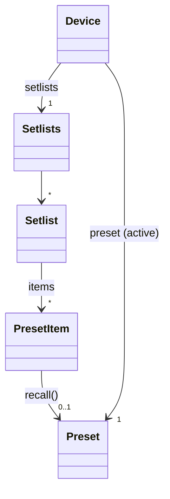
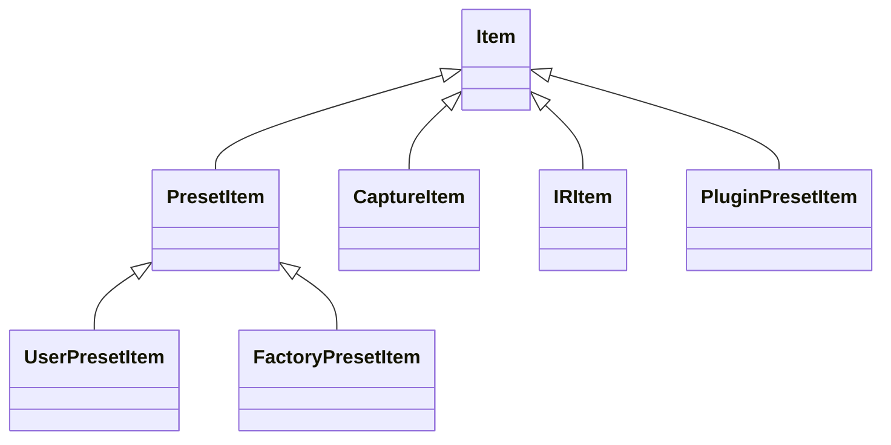
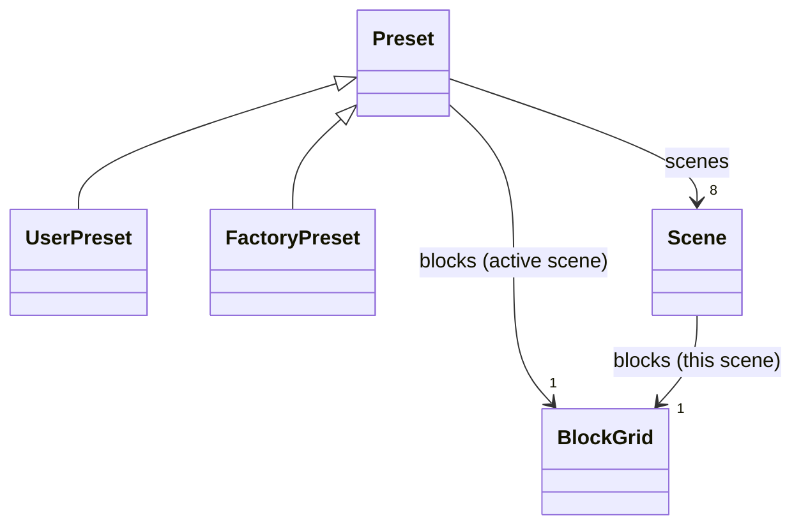
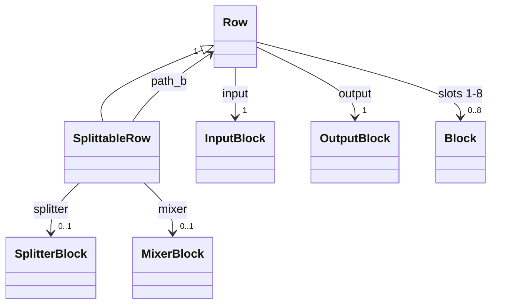
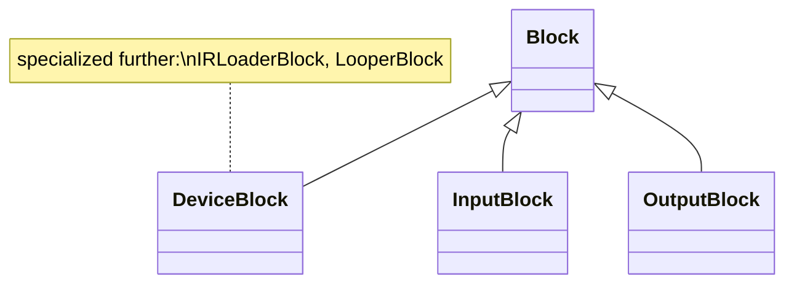
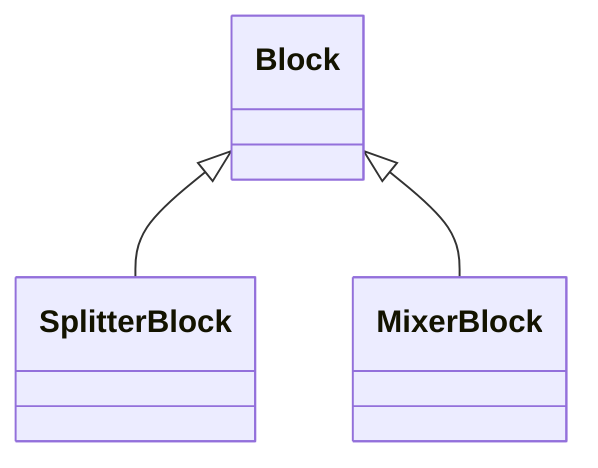
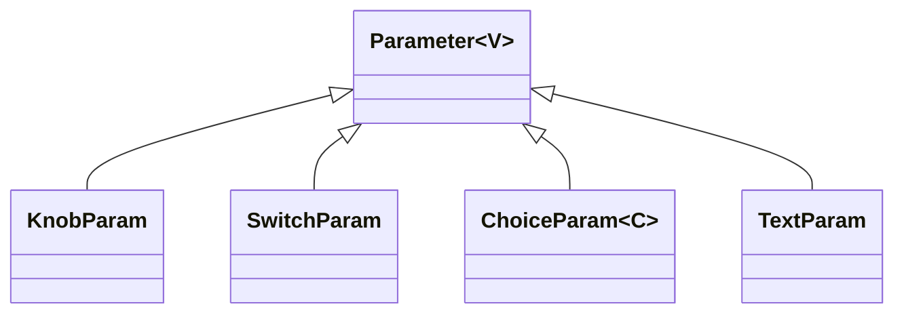

# The domain model

> Purpose: the design of the model layer, a Python API that looks and behaves like the unit, with what is built, what is planned, and what is left out and why.

> **Status:** the namespaces, the loaded preset, the grid and the state layer are
> built. Everything else here is design ahead of the code, and the code says what
> is built. The [Quad Cortex manual](https://neuraldsp.com/manual/quad-cortex) is
> the reference for what the unit does and how it presents itself. Where this
> design and the manual disagree, the manual wins; where the manual and the
> touchscreen disagree, the touchscreen wins.

## Design principles

1. **Screen-faithful, in the manual's own words.** Objects, properties, names and
   units match what the unit shows. Rows are 1 to 4 and slots 1 to 8 (the manual's
   word for the eight cells in a row); scenes are letters; knobs read in dB, Hz
   and ms where the screen does. Where the manual has a word, the model uses it
   rather than the wire's: `slot` not `column`, *virtual device* not *model*,
   *item* not *entry*.
2. **Strongly typed, deliberately polymorphic.** Every value has a real type:
   enums where the option set is fixed, value types where it is structured.
   Capability differences are type differences: a factory preset has no `save()`
   rather than raising, and a row that cannot start a split has no `splitter`.
3. **Omission over caveat.** If a feature cannot be represented faithfully yet,
   the model omits it and the appendix says why. It stays reachable through the
   protocol layer. No model API ships with a "this might be stale" caveat. A
   control we understand but cannot drive is the exception: it is modelled and
   refuses (ADR-0007).
4. **Nothing audible is a side effect.** Recalling a preset and activating a
   scene change what comes out of the outputs. In the model these are explicit
   calls (`item.recall()`, `scene.activate()`), never a consequence of reading a
   property.
5. **One translation boundary.** The model speaks screen coordinates and display
   units everywhere. Conversion to wire values happens in one package,
   `pyquadcortex/device/translate/`, and a test reads the source of the whole
   package outside `protocol/` to prove nothing else converts (ADR-0013).

## Namespaces: the model is the front door

The model takes the top-level namespace and the protocol layer is
`pyquadcortex.protocol`, public and supported (ADR-0006):

```python
import pyquadcortex

with pyquadcortex.connect() as device:          # the model: a Device
    ...

from pyquadcortex import protocol
qc = protocol.connect()                          # the protocol layer's QuadCortex
```

`Device.from_client(qc)` builds a model on an existing protocol connection, so
the two layers mix in one script. Built; the version is cut once the model can
read a preset, so no published release has `connect()` meaning two things.

---

# Part 1 - Structure

## 1. Device and the Directory



```python
class Device:
    # identity
    firmware: str                       # e.g. "d14e"
    serial: str

    # the preset on The Grid right now - never None on a connected device,
    # because the unit always has one loaded (see section 9)
    preset: Preset
    def recall(self, target: PresetItem | PresetAddress | str) -> Preset: ...  # "28C" works

    # the Directory
    setlists: Setlists                  # setlists["My Presets"], .factory, .my_presets
    favorites: Sequence[PresetItem | PluginPresetItem]
    recents: Sequence[PresetItem]
    captures: Library[CaptureItem]
    irs: Library[IRItem]
    plugin_presets: Library[PluginPresetItem]

    virtual_devices: VirtualDeviceList  # the VIRTUAL DEVICE LIST (section 5)

    # device-level features (section 6)
    io: IO                              # includes io.global_eq
    tuner: Tuner
    tempo: Tempo
    modes: Modes
    settings: Settings                  # Device Settings
    system: System                      # System Settings
    master_volume: MasterVolume
    gig_view: bool                      # open/close Gig View
    power_state: PowerOption            # read-only: awake vs standby (section 12)
```

`Setlists` covers every preset container the Directory shows: `Factory Presets`
and `My Presets`, both non-deletable, as `.factory` and `.my_presets`, plus the
user setlists, created and deleted through the model (`setlists.create(name)`,
`setlist.delete()`, `setlist.rename(name)`; M3). The manual's limits (10 user
setlists, 256 presets each) are the unit's to enforce; the model reports the
unit's refusal. It is `.my_presets`, not `.user`, because the manual uses "user
setlist" for the ten a player creates.

```python
class Setlist:
    name: str
    def __getitem__(self, where: PresetAddress | str) -> PresetItem: ...  # setlist["28C"]
    def __iter__(self) -> Iterator[PresetItem]: ...
    def find(self, name: str) -> PresetItem | None: ...

class PresetAddress:
    """Where a preset lives, as the Directory shows it: a bank and a position in it."""
    bank: int
    position: str                       # "A".."H"
    # str() gives "28C"; parsing accepts the same form and rejects malformed input
```

**Bank size.** The manual contradicts itself by a factor of two (chapter 3 says
eight, chapter 5 says four). Settled on the unit: chapter 3 is right at 8, and a
`PRESET`-containing `HYBRID` mode halves it to 4. Slot names move with the mode:
linear position 5 reads "1F" normally and "2B" under the hybrid, so an address is
unambiguous only alongside the mode it was read in. `PresetAddress` is built, in
`pyquadcortex/device/translate/`, speaks the non-hybrid naming, refuses a
malformed address at parse time, and converts through the protocol layer's own
`slot_to_position` pair. The Directory that hands addresses out is not built.

### Directory items are a type family

Everything a Directory list can hold shares an `Item` base, the Directory's own
word. What you can do to an item is expressed by its type, so factory content
lacks mutating methods entirely and misuse is a type error.



```python
class Item:
    name: str
    favorite: bool                      # settable - the manual favorites "items",
                                        # including Plugin Presets

class PresetItem(Item):                 # what the Directory's preset rows show
    address: PresetAddress
    setlist: Setlist
    instrument: Instrument              # Guitar / Bass / Synth / Vocal / Other
    def recall(self) -> Preset: ...     # audible - loads the preset on the unit

class UserPresetItem(PresetItem):
    def rename(self, name: str) -> None: ...
    def move_to(self, where: PresetAddress) -> None: ...   # same-setlist confirmed so far
    def copy_to(self, setlist: Setlist,
                where: PresetAddress | None = None) -> UserPresetItem: ...
    def delete(self) -> None: ...

class FactoryPresetItem(PresetItem):
    ...                                 # no mutating methods AT ALL

class CaptureItem(Item): ...            # place with row.place(slot, capture)
class IRItem(Item): ...                 # assign to an IR Loader slot
class PluginPresetItem(Item): ...       # listing and favoriting; see appendix
```

`instrument` is on the preset item because the unit puts it there: all five values
were confirmed by setting them on the unit's own picker and reading them back
([`protocol.md`](protocol.md) section 9.2). Capture Type and Preferred Instrument
are on the wire as `ProductData.device` and `.instrument`, so `CaptureItem` can
carry both; see [section 13](#13-still-open) for the one Capture Type value the
unit's filter does not name.

`Library[I]` is the read side of the Captures, IR and Plugin Preset libraries:
iteration, `find()`, typed items. Library management (folders, rename, delete)
has no known wire path and is omitted; see the appendix. `recall()` returns a
`UserPreset` or `FactoryPreset` matching the entry's type.

## 2. Preset and Scenes



```python
class Preset:
    name: str
    address: PresetAddress
    instrument: Instrument
    has_unsaved_changes: bool           # the italic name on screen (mechanics: section 11)
    is_current: bool                    # still the loaded preset? (section 12)

    scenes: Scenes                      # scenes["B"], scenes.active, iteration
    rows: Rows                          # rows[1] .. rows[4]
    blocks: BlockGrid                   # blocks[1, 3] - row, slot; ACTIVE scene
    stomps: Stomps                      # section 7
    midi_out: PresetMidiOut             # section 7

    def save_as(self, name: str, *, setlist: Setlist | None = None,
                instrument: Instrument | None = None,
                default_scene: SceneLetter | None = None) -> UserPresetItem: ...

class UserPreset(Preset):
    def save(self) -> None: ...         # persist in place

class FactoryPreset(Preset):
    ...                                 # editable live, but only save_as() persists

class Scene:
    letter: SceneLetter                 # "A".."H"
    name: str                           # editable, as in Gig View's EDIT SCENE
    blocks: BlockGrid                   # bound to THIS scene
    def activate(self) -> None: ...     # audible - explicit, like recall
```

**Built:** `device.preset`, `preset.rows`, `row.slots`, `preset.blocks`,
`scene.blocks`, `scenes.active`, `scene.name`, `scene.activate()`, splits,
routing, `has_unsaved_changes` and `is_current` all read on hardware. Four things
above are deliberately not built, each an omission rather than a caveat
(principle 3):

- **`UserPreset` and `FactoryPreset`.** Which one you hold is a Directory fact,
  and the only method that separates them, `save()`, is M2. `device.preset` is a
  `Preset` until the split carries a method.
- **`preset.instrument`** lives on the directory listing, not in the preset
  (section 11). It arrives with the Directory.
- **`preset.address`** needs the Directory to say which setlist a position is
  in. The model already tracks the loaded slot from `SetlistPosition{READ}`.
- **Which row an output feeds.** `Output.NEXT_ROW_3` almost certainly means
  screen row 3, and almost certainly is a guess about a coordinate. So
  `output.destination` reads as the port it is, and `output.lane` is absent when
  that port feeds a row, which is what the screen shows.

**The scene/grid duality.** Blocks are placed once per preset; bypass state and
scene-following parameter values vary per scene. A `BlockGrid` is a binding of
the grid to a scene context: `preset.blocks` is live-bound and always reads and
writes through the active scene, like the touchscreen; `scene.blocks` is
fixed-bound to that scene. Scene-invariant facts (which device is placed, where)
are identical through every binding. As built, two bindings hand back two handles
on the same cell, sharing the payload underneath; they compare equal, and `is` is
not the test.

Writing through a non-active scene's binding is refused, because the unit cannot
do it without switching scenes, which changes what you hear
([section 10](#writing-to-a-scene-you-are-not-in)). Reads through such a binding
are fine.

The default scene follows the unit's rule: it is set by saving while that scene
is active, surfaced as the `default_scene` argument on the save methods.

## 3. Rows and blocks



```python
class Row:
    number: int                          # 1..4, as on screen
    input: InputBlock
    output: OutputBlock
    slots: Slots                         # row.slots[3], 1..8 - the manual's word
    def place(self, slot: int,
              device: VirtualDevice | CaptureItem) -> DeviceBlock: ...

class SplittableRow(Row):
    """Rows 1 and 3 only: a branch can start here, with its parallel path below."""
    splitter: SplitterBlock | None        # at most one
    mixer: MixerBlock | None              # None = Path B goes to its own output
    path_b: Row                           # row 2 for row 1, row 4 for row 3
    def create_split(self, at: int) -> SplitterBlock: ...
    def rejoin(self, at: int) -> MixerBlock: ...      # adds the mixer
    def clear_split(self) -> None: ...                # removes both

class Rows:
    @overload
    def __getitem__(self, row: Literal[1, 3]) -> SplittableRow: ...
    @overload
    def __getitem__(self, row: Literal[2, 4]) -> Row: ...
```

**A split belongs to a pair of rows, and only the upper row can start one.** The
manual routes "Rows 1 or 3 (Path A) to Rows 2 or 4 (Path B)", so rows 1 and 3
are `SplittableRow` and rows 2 and 4 are plain `Row`, which makes
`rows[2].create_split()` something your editor rejects. A `SplittableRow` is
Path A and its `path_b` is Path B. The static catch needs a literal index; a
computed index resolves to `Row | SplittableRow`.

**A split need not rejoin.** The manual allows Path B to reach its own output or
merge back, so `mixer` is optional: `create_split()` alone leaves Path B with its
own output, and `rejoin()` adds the mixer later.

The block family mirrors what the grid can show:





```python
class Block:
    row: int
    slot: int                            # 1..8; input/output blocks sit outside 1-8

class DeviceBlock(Block):                # a placed virtual device
    device: VirtualDevice                # what the parameter editor calls
                                         # VIRTUAL DEVICE NAME
    bypassed: bool                       # per scene, via the binding
    params: Params                       # params["GAIN"] -> Parameter (section 4)
    stomp: StompAssignment | None        # section 7
    expression_bypass: ExpressionBypass | None
    def remove(self) -> None: ...
    def move_to(self, row: int, slot: int) -> None: ...   # cross-row = branch
    def replace(self, device: VirtualDevice) -> DeviceBlock: ...

class IRLoaderBlock(DeviceBlock):
    ir_slots: tuple[IRSlot, IRSlot]      # ir_slot.ir = an IRItem, by library key

class LooperBlock(DeviceBlock):
    state: LooperState                   # read-only: five states incl. OVERDUBBING
    # transport actions are NOT drivable over USB; MIDI CC#48-61 is the documented
    # route - see the appendix

class InputBlock(Block):
    source: InputSource                  # which physical input feeds this row
    gate: InputGate                      # NOISE REDUCTION / BYPASS / INPUT GAIN, per scene

class OutputBlock(Block):
    destination: OutputDestination       # physical out, send, USB, another row, Multi-Out
    lane: LaneOutput | None              # the manual's LANE OUTPUT CONTROL:
                                         # VOLUME/PAN/MUTE/SOLO, per scene. None when
                                         # routed to another row (as on screen)

class SplitterBlock(Block):
    params: Params        # TYPE, STEREO, BALANCE, LEVEL TO A/B, FREQUENCY, MODE, MUTE
    muted: bool           # the same control as the mixer's MUTE - see below

class MixerBlock(Block):
    params: Params        # LEVEL A/B, PAN A/B, PHASE, MIXER LEVEL, MUTE
    muted: bool           # the same control as the splitter's MUTE - see below
```

**The splitter's `MUTE` and the mixer's `MUTE` are one control.** The manual
lists one under each editor; on the unit they are linked, and neither model's
catalog entry carries it ([`protocol.md`](protocol.md) section 7.6). Both screen
paths are kept and `muted` on either object is the same state.

A refused placement (DSP capacity) raises `CapacityError`, detected rather than
predicted, because the wire offers no headroom read. A cross-row `move_to`
creates a branch, as dragging does on the touchscreen. Side-chain `SOURCE` is an
ordinary `ChoiceParam` on the blocks that have it.

### The collections

```python
class Setlists:                          # device.setlists
    factory: Setlist                     # Factory Presets
    my_presets: Setlist                  # My Presets
    def __getitem__(self, name: str) -> Setlist: ...
    def __iter__(self) -> Iterator[Setlist]: ...
    def create(self, name: str) -> Setlist: ...        # M3

class Library(Generic[I]):                # captures, IRs, plugin presets
    def __getitem__(self, name: str) -> I: ...
    def __iter__(self) -> Iterator[I]: ...
    def find(self, name: str) -> I | None: ...

class Scenes:                            # preset.scenes
    active: Scene
    def __getitem__(self, letter: str) -> Scene: ...   # scenes["B"]
    def __iter__(self) -> Iterator[Scene]: ...

class Slots:                             # row.slots - the eight cells in a row
    def __getitem__(self, slot: int) -> Block | None: ...   # 1..8
    def __iter__(self) -> Iterator[Block | None]: ...

class BlockGrid:                         # preset.blocks / scene.blocks
    def __getitem__(self, where: tuple[int, int]) -> Block | None: ...  # [row, slot]
    def __iter__(self) -> Iterator[DeviceBlock]: ...   # occupied cells only

class Params:                            # block.params
    def __getitem__(self, name: str) -> Parameter: ...  # params["GAIN"]
    def __iter__(self) -> Iterator[Parameter]: ...
```

## 4. Parameters



```python
class Parameter(Generic[V]):
    name: str                            # the label on screen
    value: V                             # typed get AND set
    follows_scenes: bool                 # settable: promote/demote (tap-and-hold on screen)
    expression: ExpressionAssignment | None      # section 7

class KnobParam(Parameter[float]):
    unit: str                            # "dB", "Hz", "ms", "%", ""
    range: Range                         # min/max as displayed

class SwitchParam(Parameter[bool]): ...  # two states only; see the note below

class TextParam(Parameter[str]): ...     # a free-text field, where one exists

class ChoiceParam(Parameter[C]):         # dropdowns, and switches of three or more
    options: Sequence[C]
```

**Switches are not always boolean.** The manual's switches toggle "between two or
more discrete states". `SwitchParam` covers the two-state case; a switch with
three or more is a `ChoiceParam`. No confirmed `TextParam` exists yet: a cab's
microphone, the only candidate, is described by the manual as selectable.

**Values are what the screen shows.** A knob that displays -6.0 dB reads and
writes `-6.0`. The wire scale is the translation boundary's problem. A parameter
whose display mapping is unverified is omitted until verified (principle 3).

**Choice types.** Where the option set is fixed, `C` is a real enum
(`ChoiceParam[TimeSignature]`). Where the list is dynamic but structured, such as
routing sources whose membership grows with the preset, `C` is a value type
(`Source`) parsed from the unit's own option list. Only free-form lists fall back
to `str`. Option names for a dynamic list come from the preset's own
`dynamic_steps`, so they match the screen exactly. For a fixed list they come
from the catalog's `stepNames`, which the appendix says how far to trust.

## 5. The Virtual Device List

```python
class VirtualDeviceList:                 # the VIRTUAL DEVICE LIST, as on screen
    categories: Sequence[Category]       # AMP, CAB, DELAY ...
    def find(self, name: str) -> VirtualDevice | None: ...
    pinned: Sequence[VirtualDevice]
    def pin(self, device: VirtualDevice) / unpin(...): ...

class VirtualDevice:
    name: str                            # the parameter editor's VIRTUAL DEVICE NAME
    category: Category
    stereo: bool
    sidechain: bool                      # the (S/C) marker
```

The list is the unit's own catalog, so it reflects purchased and captured content.
Named for the screen, not the wire: the protocol calls this the model repository
and its entries models, and the unit's own words are `VIRTUAL DEVICE LIST` and
`VIRTUAL DEVICE NAME`. The code directory is `device/`, not `model/`, because the
protocol layer spells a block `model` (`models.py`, `Model`, `ModelCatalog`).

## 6. Device-level features

Each feature object mirrors one screen or menu on the unit.

```python
class IO:                                # the I/O Settings menu (swipe down)
    inputs: Mapping[str, InputPort]      # "INPUT 1", "INPUT 2"
    returns: Mapping[str, ReturnPort]
    outputs: Mapping[str, OutputPort]    # "OUT 1/L" .. "OUT 4/R", sends
    output_pairs: Mapping[str, OutputPair]   # OUTPUT PAIRING, per pair
    expression: Mapping[str, ExpressionPort] # "EXP 1", "EXP 2" - tappable here
    usb: USBPorts
    global_eq: GlobalEQ                  # tapped at the TOP of I/O Settings

class InputPort:
    level_db: float
    impedance: Impedance                 # enum; disabled in Mic type, as on screen
    input_type: InputType | None         # Instrument / Mic. None on ESS-codec units,
                                         # which show no TYPE switch at all
    # PHANTOM 48V: omitted - no field exists in the schema (appendix)

class OutputPort:
    level_db: float
    ground_lift: bool
    muted: bool
class OutputPair:
    linked: bool                         # OUTPUT PAIRING; paired outs share values

class ExpressionPort:
    position: float                      # read-only: the POSITION indicator
    # RECALIBRATE: omitted - no known wire path (appendix)

class USBPorts:
    level: float
    hp_source: HPSource                  # enum
    dry_wet: DryWet                      # enum: DI vs processed on outs 1/2, 3/4
    midi_thru: bool                      # listed on this screen AND under Device MIDI

class GlobalEQ:                          # a sub-screen of I/O Settings, per the manual
    bypassed: bool
    bands: Sequence[EQBand]              # 5 bands
    outputs: EQOutputAssignment          # out 1/2, out 3/4
    auto_disabled: bool                  # read-only: the unit sheds it under DSP pressure
class EQBand:
    filter_type: FilterType
    gain_db: float                       # -12..+12
    frequency_hz: float                  # 20..20k
    q: float
    bypassed: bool                       # the screen says EQ BAND BYPASS
    # the OUT tab's overall LEVEL: omitted - dB mapping unverified (appendix)

class Tuner:
    visible: bool                        # show/hide the Tuner menu
    reference_hz: float                  # displayed absolute Hz (wire stores the offset)
    source: TunerSource                  # inputs, returns, INPUT_1_2, USB 5/6
    muted: bool
    # LIVE TUNER (the streaming needle): omitted by decision (appendix)

class Tempo:                             # the Tempo & Metronome menu
    bpm: float                           # the tempo IN EFFECT - see the note below
    mode: TempoMode                      # GLOBAL or PRESET, as the menu shows it.
                                         # The wire path is the device tempo block's
                                         # parameter 1 (protocol.md section 8.1)
    led: bool
    metronome: Metronome
class Metronome:
    muted: bool                          # MUTE on the unit, PLAYBACK in the manual:
                                         # one control. It mutes; it does not stop the
                                         # clock (section 9)
    volume: float
    pan: float
    time_signature: TimeSignature
    subdivision: Subdivision
    sound: MetronomeSound
    routing: MetronomeRouting

class Modes:
    active: ModeSlot                     # what the top-right corner shows
    cycle: Sequence[ModeSlot]            # reorder / merge / remove via set_cycle
    def set_active(self, slot: ModeSlot) -> None: ...
    def set_cycle(self, slots: Sequence[ModeSlot]) -> None: ...
# ModeSlot = Mode | HybridMode; Mode is PRESET/SCENE/STOMP,
# HybridMode(top=..., bottom=...) models all six ordered pairings.
# A cycle holds at most one hybrid and a hybrid cannot be the only slot -
# the device's own rules, enforced by the device; the model surfaces its refusal.

class MasterVolume:
    level: float                         # writable (protocol.md section 11.3)
    outputs: set[OutputAssignment]       # the overlay's checkboxes

class Settings:                          # the DEVICE SETTINGS section of chapter 10
    global_bypass: GlobalBypass          # Cab / IR Loader, four rows each
    scene_bypass_behavior: SceneBypassBehavior   # enum, three modes
    stomp_mode_bypass: bool              # the screen's own label
    hold_timing_ms: int                  # 500-1000 in 100 ms steps, as on screen
    swap_tempo_and_tuner: bool
    gig_view_access: bool
    latency_compensation: bool
    midi: MidiSettings                   # channel, thru, over USB, ignore dup PC, clock in/out

class System:                            # the SYSTEM SETTINGS section of chapter 10
    brightness: Brightness               # screen and LED brightness
    storage: Storage                     # read-only: presets/captures/IRs disk usage
    master_volume_knob: MasterVolumeKnob # enum: global vs output-specific
```

**`Tempo.mode` is a device setting**, even though it rides a tempo message.
Writing it affects every preset and there is nothing to save. The unit keeps both
tempo blocks at all times and `mode` selects which one plays, so `bpm` is the
tempo in effect: the preset's own tempo in `PRESET` mode and the device's in
`GLOBAL` mode. It belongs to the M3 device-settings surface with the rest of
`Tempo`.

**Two sections, not one.** Manual chapter 10 has four subsections: Account,
System, Device, Support. Brightness, storage and the master-volume knob function
live under System, the other eight rows under Device, so `settings` and `system`
are separate objects. Account and Support are omitted: cloud surfaces are out of
scope, and Support is diagnostics.

## 7. Assignments and Preset MIDI Out

```python
class StompAssignment:                   # footswitches A-H in Stomp mode, per preset
    footswitch: FootswitchLetter         # "A".."H"
    targets: Sequence[DeviceBlock]       # one switch can toggle several blocks
    label: str                           # EDIT STOMP's custom name
    momentary: bool                      # the unit's Assign footswitch modal has a
    #   Latching/Momentary toggle the manual never mentions. Settable ONLY when
    #   len(targets) == 1 - the device silently refuses a multi-block switch and
    #   greys its own toggle out in the same case, so the model refuses too.

class Stomps:                            # preset.stomps
    def __getitem__(self, footswitch: str) -> StompAssignment | None: ...
    def assign(self, footswitch: str, block: DeviceBlock,
               label: str | None = None) -> StompAssignment: ...
    def clear(self, footswitch: str) -> None: ...
```

**The footswitch letter is a type, not a convention.** `stomp_is_momentary` is
keyed by footswitch index, and a footswitch index and a block's column are
different numbers that usually agree (a block at column 3 assigned to footswitch E
has key 4). `FootswitchLetter` is the model's only public key for a footswitch;
the zero-based index stays inside the protocol layer. Built, as a `StrEnum` in
`pyquadcortex/device/translate/`: `stomps["E"]` and `stomps[FootswitchLetter.E]`
are the same key, and passing the number 4 raises. `SceneLetter` is the same type
for scenes.

A device-level footswitch object is deferred. There are two footswitch-keyed
collections at different scopes, `preset.stomps` per preset and
`settings.looper_actions` global, plus the mode that decides which is live, so
nothing answers "what does switch E do right now". Revisit at M2.

```python
class ExpressionAssignment:              # assigned FROM the parameter, as on screen
    pedal: ExpressionPedal               # EXP 1 / EXP 2
    minimum: float                       # MIN RANGE, in the parameter's own units
    maximum: float                       # MAX RANGE; min>max reverses, as documented

class ExpressionBypass:
    mode: ExpressionSwitchMode           # HEEL_TOE / SWITCH / STOP
    invert: bool                         # INVERT RANGE
    switch_delay_ms: int                 # SWITCH DELAY, real ms; greyed out in SWITCH mode
    latch_emulation: bool                # LATCH EMULATION; greyed out in HEEL_TOE mode
    # All three verified on hardware as ExpressionBypassInfo{invert, delay_ms,
    # latch_emulation}; a false always travels as an absent field. The mode
    # decides which of the last two exist (protocol.md section 7.8).

class PresetMidiOut:                     # preset.midi_out - the Preset MIDI Out menu
    on_load: Sequence[OnLoadMessage]
    footswitches: Mapping[FootswitchLetter, Sequence[FootswitchMessage]]
    expression: Mapping[ExpressionPedal, Sequence[FootswitchMessage]]
# FootswitchMessage = ControlChange | ControlChangeToggle | ProgramChange
# OnLoadMessage     = ControlChange | ProgramChange
```

On-load messages cannot be CC Toggle: the manual gives footswitch and expression
messages three types and on-load messages two, so the narrower screen is the
narrower type. Expression-assigned parameters are excluded from scene data (the
unit's rule), so assigning a pedal fixes `follows_scenes` off.

## 8. Errors

- `CapacityError`: the unit refused a placement or move (DSP headroom). Detected,
  not predicted.
- `DeviceLostError`: the unit went away. Detection is in
  [section 12](#12-disconnect-standby-and-reconnect); the protocol layer raises
  this type.
- Static prevention beats runtime errors everywhere types can carry the rule.

The unit accepts and ignores writes it does not understand, so the model's
contract is: **every mutating call either verifies acceptance or is backed by a
hardware-confirmed protocol method.** The mechanics are in
[section 10](#10-writing-and-knowing-a-write-landed).

---

# Part 2 - Behaviour

How the model tracks what the unit is doing, and how saving works. Every number
here was measured on CorOS 4.0.1. Where something was not established, it says so
([section 13](#13-still-open)).

## 9. How the model keeps its facts current

The model remembers what it learned from the unit, so reading a value is fast.
The risk is that someone touches the unit and what we remember goes wrong. Three
rules handle it.

**1. The unit tells us when things change.** Turn a knob on the touchscreen and
the unit sends a message saying what changed. We store the new value. One on-unit
edit produced 40 `Grid` pushes.

**2. If a message mentions something we do not model, we stop trusting our
copy.** Then we discard our copy of that entry and read a fresh one. Slower, and
right. A message of a type no entry tracks is ignored, which is what the RX thread
already does. The check is per field, not per message type: applying the half of
a message we understand and dropping the rest is the one failure that leaves the
cache confidently wrong (ADR-0011).

Two message types are handled by type rather than by field, because the per-field
check cannot see them. `Grid` carries its meaning in `action`, which the wire
gives no presence, so an `UPDATE` and a `DELETE` with the same payload look
identical. `SceneLabel` gives `index` and `label` no presence either, so renaming
a scene to a blank label sets nothing a field check can see. Both are declared as
voiding the copy outright (ADR-0012).

**A grid push is not merged.** A `Grid` echo is a sparse, keyed delta into a
deeply nested structure. Rather than apply it, the model notes that the grid moved
and re-reads the whole live preset on the next access. Forty pushes cost one
re-read, because the note is a flag rather than a queue, and `RecallPreset{READ}`
has no side effects. Merging would need each push applied by key (chain by row,
model by column, parameter by index) and the "did this mention something we do
not model" check walking the structure recursively. The prize is instant reads
while somebody edits on the unit; the risk is the recursive check, so it is not
built. A caller who needs the fresh value sooner subscribes to `device.events`.

**A push carrying every field an entry keeps clears the mark**, because it is the
same thing a read returns. That is what makes the connect burst leave the cache
warm: the burst delivers `RecallPreset`, `SetlistPosition`, `PresetDirty` and
`Scene` inside ten milliseconds, so two entries are marked by one message and
answered in full by the next.

**3. When we write, we update our copy immediately.** The unit echoes our change
back, and the echo confirms it. Because we already applied it, a matching echo
changes nothing. If a write is wrong, the echo disagrees and we have written a
bug; the place to catch that is the hardware suite, which performs every
supported write and asserts the read-back
([section 10](#10-writing-and-knowing-a-write-landed)).

### What we track, and how each part stays current

| What | Where you read it | How we ask | What tells us it changed |
|---|---|---|---|
| The preset on the grid now | `device.preset` (**built**) | `RecallPreset{READ}` | `Grid`, `RecallPreset` |
| Which scene is active | `preset.scenes.active` (**built**) | `Scene{READ}` | `Scene` |
| Scene names and colours | `scene.name` | comes with the preset | `SceneLabel`, `SceneColor` |
| Unsaved edits | `preset.has_unsaved_changes` (**built**) | `PresetDirty{READ}` | `PresetDirty`, and a recall, which pushes nothing, so it is re-read |
| Which preset is loaded | `preset.is_current` (**built**); `preset.address` needs the Directory | `SetlistPosition{READ}`, 3 ms | `SetlistPosition` |
| What is in a setlist | `setlist` iteration | `File{READ}` | `File` |
| Recents and favorites | `device.recents`, `.favorites` | `RecentsFavorites{READ}` | `RecentsFavorites` |
| I/O, settings, EQ, volume, mode | `device.io` and friends | one `READ` each | one push each |
| Power state (awake / standby) | `device.power_state` | in general settings | `GeneralSettings` |
| Device list, firmware, serial | `device.virtual_devices`, `.firmware` | `ModelRepo`, `Version` | nothing; these do not change |

The third column is the safety net. Wherever the fourth is unreliable, we ask
instead of remembering, which is what lets the model never hand back a value with
a "might be stale" caveat. An entry with no read is not an entry: each remaining
row lands with the surface that reads it.

### Telling a caller what we noticed

Re-reading happens only when somebody asks for a value, which is too late for a
script following the unit closely. So the model publishes what it noticed:

```python
with pyquadcortex.connect() as device:
    device.events.subscribe(print)
```

Two events, both about the model's copy. `Changed(part, fields)` when a push
moved a value we hold, and `Invalidated(part, why)` when we stopped trusting our
copy of something. `Invalidated` fires on the change from trusted to untrusted,
so one edit on the touchscreen produces one event rather than forty, and
`Changed` fires only when a value moved.

**A subscriber runs on a thread the model owns, and may read from the unit.**
Messages arrive on the RX thread, which may not read (ADR-0009), so handing an
event over there would make the obvious reaction raise. The RX thread queues; the
model's thread delivers, one subscriber at a time in subscription order. A
subscriber that blocks holds up the ones behind it and never delays the unit.

### Smaller decisions

1. **Connecting warms almost everything.** The handshake's burst delivers one
   message of nearly every state type ([`protocol.md`](protocol.md) section
   12.1), so the cache is warm for free and the read paths are the fallback.
2. **Pushes are often partial.** An absent field means "not mentioned", never
   "changed to default", so pushes merge into our copy rather than replacing it.
3. **Recalling a preset resets three things at once**: the grid contents, the
   active scene, and the unsaved-changes flag. The unit moves them together, so we
   do too. It is declared once, on the entry that knows which slot is loaded, and
   fires only when that slot changes.
4. **Deleting or moving a preset needs a retry.** The unit's listing lags a
   couple of seconds, so we re-read until the listing reflects the change.
5. **The RX thread never asks the unit for anything.** It applies pushes and
   notes what needs re-reading; the caller's thread does the reading.
6. **Reconnecting discards everything**, firmware and serial included
   ([section 12](#12-disconnect-standby-and-reconnect)).
7. **The tempo stream is not a change signal.** The metronome clock always runs,
   so `GlobalTempo` arrives in pairs, one pair per beat, on every connection.
   Applying pushes as data does not care. The control that looks like a start/stop
   is one control with three names (`MUTE` on the unit, `START` in the catalog,
   `PLAYBACK` in the manual) and it silences the metronome rather than stopping
   the clock, so the model calls it `metronome.muted`.

## 10. Writing, and knowing a write landed

The unit accepts writes it does not understand and does nothing, so "no error"
proves nothing. What we have instead is the echo.

**The echo is a sparse, keyed delta.** Writing one parameter produced a `Grid`
push of 23 bytes: one chain with `row` set, one entry with `column` set, one
parameter. That is the opposite of a recalled preset, whose chains carry no
explicit row, so an echo merges into our copy with no guessing. Echo latency is
113 to 116 ms for a parameter write and 290 to 420 ms for a block placement, and
those two set the watcher's window ([`protocol.md`](protocol.md) section 12.3
has the rest).

**Each write gets a watcher** that compares the echo against what we sent and
reports one of three outcomes:

- **Confirmed**: every field we sent came back with the value we sent.
- **Different**: a field we sent came back with another value. Log the field,
  what we sent, and what came back. That is a bug in our code, and the entry is
  marked for a re-read too, because the other fields in the same write went into
  the cache on our say-so.
- **Timed out**: nothing came back. Log it and mark that part of our copy for
  re-reading, so a silently ignored write self-corrects instead of poisoning the
  cache.

The watcher does not block the write, and the bar is one sentence: every field we
sent must come back with the value we sent. Not "the echo equals what we sent",
because the unit legitimately changes things we did not ask about, and applying
the whole echo handles all of them:

| The unit also changes | Why |
|---|---|
| `GAIN REDUCTION` (`input_control` index 2) | a live meter, sampled into the preset at save time |
| A mirrored parameter | writing the metronome mute also moves a Looper X parameter |
| NaN in unused parameter slots | factory presets store it; NaN never equals itself |
| Dropdown values on untouched rows | adding a block changes the option count, so stored values are recomputed |

**Placement is the one write that waits.** Whether a block fits depends on how
much DSP the preset already uses, and DSP load is unreadable, so there is no test
we can pre-run. The unit echoes every cell it accepts and gives a refused block no
echo, so `row.place()` waits for that echo and raises `CapacityError` when it
does not come. It returns in about a third of a second normally.

Everything else updates our copy immediately and is confirmed in the background.

### Writing to a scene you are not in

The unit has no way to write to a scene that is not active; you switch to it
first. So `scene.blocks[1, 3].bypassed = False` on an inactive scene would have
to activate that scene, which changes what comes out of the outputs and leaves it
changed. **A `BlockGrid` bound to an inactive scene refuses writes**, and the
error names `scene.activate()` as the step to take. Reads through it are fine.

## 11. The save lifecycle

**How the unit works.** There is no separate edit buffer. You edit the grid
directly, and what is on the grid is what you hear. Saving snapshots the grid
into a slot: the save message carries no preset data, just a slot and a name.
That is why the protocol edit path is recall, then keyed edits, then save. The
model hides all three: you get a preset, change it, and call `save()`.

**Two ways to save.** `save()` writes back to the same slot under the same name;
re-saving the same name to the same slot is not a collision, so the unit does not
append a suffix. `save_as(name)` writes to a new slot or name, and that can
collide; the unit renames rather than refusing, so the returned `UserPresetItem`
is the authority on what was stored.

**Factory presets.** You can edit a factory preset on the grid and hear the
change; you cannot save it in place. `FactoryPreset` has no `save()`, so it is a
mistake your editor catches. `save_as()` on a factory preset targets a user
setlist, defaulting to My Presets.

**Losing edits.** Recalling another preset discards unsaved changes and resets
the active scene. The model does the same, because that is what the unit does.
What makes this safe is principle 4: recalling is always an explicit call, and
`preset.has_unsaved_changes` is there to check first.

**`has_unsaved_changes` is cheap and always available.** `preset_dirty()`
answers in 2 to 11 ms, reads true after an edit and false after a clean save, and
the unit pushes it unsolicited in the connect burst and on the first edit. So the
model subscribes rather than polls. `is_dirty` has no field presence, so absent is
false.

**Two warts the model hides.** Place a Neural Capture, bypass it, save, and the
bypass is gone: it survives on the live grid and not the first save, while an
ordinary block in the same row is fine. The sequence that works is save, recall
the slot, set the bypass again, save again (verified on 24 presets). `save()`
performs that sequence itself when the preset has a freshly placed capture with a
non-default bypass, and restores the active scene afterwards. And a preset's
default scene is whichever scene was active when it was saved, so
`save(default_scene="C")` activates scene C, saves, and returns to the scene you
were on. That is audible twice.

**What no save can keep.** Descriptive tags are lost by every save path including
the unit's own, so a preset derived from a factory preset is untagged. The
instrument category is separate and does survive, because it lives on the
directory listing rather than in the preset.

## 12. Disconnect, standby, and reconnect

**The unit going away is free to detect.** A read raising means the unit is gone;
a write raising means nothing (every write to a healthy unit "fails" via the
status-stage stall). Nothing branches on the exception text, which is often the
stale write-stall lookalike. The protocol layer surfaces this as
`DeviceLostError`.

**Asleep is not the same as gone.** Standby ("Be Right Back") does not
disconnect: the session stays alive and the unit announces it with a partial
settings push carrying only `power_option: 2`, then `3` on waking. Reboot and
shutdown send nothing before the reads start raising. So a script can be talking
to a sleeping unit over a healthy connection; `device.power_state` makes that
visible. Reading the field is all the model does with it, since writing
`power_option` would let a script shut the unit down.

**Lock mode does not block us.** With the screen and volume knob locked, a
parameter write landed and read back exactly.

**Reconnect is transparent, and logged.** When the model notices the unit has
gone:

1. The RX thread records the loss, logs a warning, and stops.
2. Everything we remembered is discarded, firmware and serial included.
3. The next call from the caller's thread reconnects: find the unit, open it, run
   the handshake. Recovery happens on the caller's thread.
4. If that call was a read, it runs again and returns normally, a few seconds
   later.
5. If it was a write, it raises. We never replay it: a unit that came back may
   have been power-cycled with a different preset on the grid.

**Opening the device proves nothing about readiness.** There is a window where
the unit is enumerated and openable but the control protocol does not answer,
about 9 s after a reboot and 11.7 s after a cold boot, so the handshake itself is
retried (`handshake_patience`, 30 s). Unattended recovery from a reboot took about
55 seconds end to end.

**A held preset can go stale, so it checks itself.** If you hold a `Preset` and
the loaded slot changes, that object now points at something else. Every mutating
call checks first, locally against the loaded slot we track, and raises rather
than editing the wrong preset. `preset.is_current` exposes the same check.
Someone tapping a different slot on the touchscreen invalidates a held preset just
as thoroughly as a reconnect, and one rule covers both. `device.preset` always
returns the current one.

## 13. Still open

### Genuinely open

- **`RecallPreset.reason` `UNDO`.** The value exists in the schema and has never
  been observed. The unit's undo is reachable from a host (`UndoRedo{UPDATE,
  undo: true}`, measured 2026-09-03 on CorOS 4.0.1 and by a contributor on 4.1.0
  in PR #42). Whether the recall that follows carries `reason: UNDO` was not
  captured in either session.
- **The writability half of `Parameter.hidden`.** The flag was tested against
  the screen, which it predicts most of the time and not always
  ([Catalog attributes](#catalog-attributes)). Nobody has tried writing a hidden
  parameter, so that half of the question is untested.
- **Bypass persistence over MIDI.** The unit's own `SCENE BYPASS BEHAVIOR` wording
  groups MIDI with footswitches, not with the touchscreen. A USB HID write behaves
  like the touchscreen; the MIDI half is untested because this library has no MIDI
  path.
- **The first-generation I/O variant.** `Version.is_ess` is the discriminator and
  reads `True` here. Only an ESS unit has been available, so the first-generation
  value is inferred from the field's name, and the correlation with
  `InputPort.input_type` presence rests on one machine.
- **Capture Type value 8.** `ProductData.device` is the manual's Capture Type,
  keyed zero-based against the unit's own filter list: Default, Amp, Combo Amp,
  Amp + Cab, Cab, Overdrive, Fuzz, Compressor. A ninth value, `8`, is in use by
  102 factory V2 captures, all drive and distortion pedals, and the filter offers
  no category for it. Those captures list normally with no filter applied.

### Closed, with where the answer lives

| was open | outcome |
|---|---|
| Device-wide push sweep | swept; all eight action categories captured |
| Echo latencies for the unmeasured write types | `tests/hardware/test_write_echo.py`; `protocol.md` section 12.3 |
| Writes during standby | honoured, and they survive the wake |
| Bank size, 8 versus 4 | 8, and 4 under a `PRESET` hybrid; slot names are mode-dependent |
| Scene name and colour writes | `SceneLabel` and `SceneColor`. An edit made on the unit re-sends all eight; a host write echoes only the index it wrote |
| Scene copy and swap | `SceneCopy{from_index, to_index, is_swap}` |
| The three ExpressionBypass fields | `invert`, `delay_ms` in real milliseconds, `latch_emulation` |
| SCENE BYPASS BEHAVIOR persistence | a host write counts as a touchscreen edit; `protocol.md` section 11.1 |
| `FileMessage.type` | 0 presets, 1 IRs, 2 captures |
| `stomp.momentary` | real, host-writable, and only on a footswitch driving one block |
| The footswitch HOLD action | not an assignable action; `hold_timing` is a threshold for the unit's fixed hold gestures |
| Assign Looper X Actions | `GeneralSettings.looper_stomp_assignments`, global, indexed by footswitch |
| I/O device variant | `Version.is_ess`, subject to the caveat above |
| Capture metadata | `ProductData.instrument` and `.device`, subject to the caveat above |
| Master volume | writable; the recorded refusal was a stale read |
| Tempo `MODE` | `GlobalTempo.params[1]`: `0.0` `PRESET`, `1.0` `GLOBAL`, readable and writable. A device setting, so `Tempo.mode` is an ordinary property (ADR-0010) |

Two method notes. **A read straight after a write returns the previous value**; it
produced the master-volume "refusal" that stood for releases. **A flawlessly
repeatable negative is the instrument**: a host bypass write read as "discarded"
in all three behaviour modes because `ColBypass.column` has no presence and reads
0 on every entry, so a filter on it matched nothing. Any measurement that is
recorded deserves a control.

---

# Appendix - manual feature audit

Every feature the manual describes, mapped to the model or explicitly omitted.
**Protocol** is the current reachability from
[`manual-coverage.md`](manual-coverage.md) (*yes*, *partly*, *no*, *n/a*);
*unaudited* marks features this design pass found missing from that audit. An
omission with a protocol path of *no* becomes reachable work only after the
protocol layer grows the path.

Manual chapters 1 and 2 (welcome, hardware overview), 7 (plugin compatibility
tables), 9's host-side audio setup, and 12 (specs, regulatory) describe physical
hardware, host concerns or reference text with nothing for a host API to model.

## Chapter 3 - Global controls, quick start

| Manual feature | Model surface | Protocol | Notes |
|---|---|---|---|
| Power on/off, reboot, Be Right Back, lock | - | n/a | physical power button; the wire refuses `power_option` as a command |
| Master Volume level | `device.master_volume.level` | yes | writable. A separate gain stage downstream of the port levels |
| Master Volume output assignment | `device.master_volume.outputs` | yes | |
| Master Volume knob function | `system.master_volume_knob` | yes | the manual documents this under ch. 10 System Settings |
| Footswitch presses, touch gestures, encoders | - | n/a | physical controls |
| Recall a preset | `item.recall()`, `device.recall("28C")` | yes | |
| Bank navigation / Blinking Mode | `PresetAddress` covers the destination | yes | Blinking Mode itself is a footswitch UI flow, n/a |
| Tuner menu open/close | `device.tuner.visible` | partly | accepted on the wire; on-screen effect not yet seen |
| Tuner reference pitch | `device.tuner.reference_hz` | yes | displayed Hz; wire stores offset from 440 |
| Tuner input source | `device.tuner.source` | yes | `RETURN_1_2` refused by the unit itself |
| Tuner mute | `device.tuner.muted` | yes | |
| Live Tuner (streaming needle) | **omitted** | no | the unit refuses `enable_meter` from a host; unsupported by decision |
| Tempo (BPM) | `device.tempo.bpm` | yes | the tempo in effect; which block it comes from depends on `MODE` |
| Tempo `MODE` (Global vs Preset) | `device.tempo.mode` | yes | `GlobalTempo.params[1]`, readable and writable. A device setting. M3 with the rest of `Tempo` |
| Tap tempo | **omitted** | no | none of the 23 attributed tempo parameters is a tap; indices 23 and 24 are unattributed. MIDI CC#44 is the documented route |
| Tempo LED | `device.tempo.led` | yes | |
| Metronome volume/playback/pan/T-sig/subdivisions/sound/routing | `device.tempo.metronome.*` | yes | full enums for all four option lists |
| Per-scene tempo (Cortex Control's bottom bar claims it) | **omitted** | n/a | the unit has no per-scene tempo; `scene_tempo` is inert on the wire |
| Modes: read/set active | `device.modes.active` | yes | |
| Modes: reorder / merge to HYBRID / remove | `device.modes.set_cycle()` | yes | all six ordered hybrid pairings modelled |
| PRESET / SCENE / STOMP mode semantics | covered by `PresetAddress`, `Scene`, `Stomps` | yes | |
| Scene recall | `scene.activate()` | yes | |
| Scene assignment of a parameter (tap-and-hold) | `param.follows_scenes` | yes | the flag must travel alone on the wire; absorbed |
| Default scene on save | `default_scene=` on save methods | yes | set by saving in that scene, as on the unit |
| Scenes dropdown | `preset.scenes` | yes | |
| Stomp assignment (see ch. 4) | `preset.stomps` | yes | |
| Gig View open/close | `device.gig_view` | yes | |
| Gig View EDIT SCENE (name, colour) | `scene.name`, `scene.color` | yes | `SceneLabel` and `SceneColor` |
| Gig View SWAP SCENE / COPY SCENE | `scene.copy_from()`, `scene.swap_with()` | yes | one message: `SceneCopy{from_index, to_index, is_swap}`; the label and colour travel with the state |
| Gig View EDIT STOMP | `stomp.label`, `stomp.targets` | yes | |
| I/O: input LEVEL / IMPEDANCE / TYPE | `io.inputs[...]` | yes | fields travel one per message; absorbed |
| I/O: no TYPE switch on ESS-codec units | `InputPort.input_type` is `None` there | unaudited | the variant is `Version.is_ess`; see [section 13](#13-still-open) |
| I/O: PHANTOM 48V | **omitted** | no | no field exists in the recovered schema |
| I/O: output LEVEL / GROUND LIFT / MUTE | `io.outputs[...]` | yes | mute travels alone; absorbed |
| I/O: output pairing | `io.output_pairs[...].linked` | yes | |
| I/O: USB LEVEL / HP SOURCE / DRY-WET / MIDI THRU | `io.usb` | yes | the headphone output's own level is not writable anywhere |
| I/O: EXP 1 / EXP 2 ports | `io.expression[...]` | partly | POSITION streams as `exp_port.level`. RECALIBRATE announces `exp_port{exp_port_id, calibrating}` and has never been driven from a host |
| Global EQ: bypass, 5 bands, output assignment | `io.global_eq` | yes | whole 28-index layout mapped |
| Global EQ: OUT tab overall level | **omitted** | partly | reachable, and its dB mapping is unverified |

## Chapter 4 - The Grid

| Manual feature | Model surface | Protocol | Notes |
|---|---|---|---|
| Grid layout: 4 rows x 8 slots | `preset.rows`, `preset.blocks[r, c]` | yes | 1-based, as on screen |
| Virtual Device List: browse by category | `device.virtual_devices` | yes | the unit's own catalog |
| Virtual Device List: search | client-side over `device.virtual_devices` | n/a | |
| Pin/unpin a device | `virtual_devices.pin()/unpin()`, `.pinned` | yes | append-not-replace quirk absorbed |
| Place / replace a block | `row.place()`, `block.replace()` | yes | acceptance verified by the model |
| Remove a block | `block.remove()` | yes | |
| Move a block (drag) | `block.move_to()` | yes | cross-row move creates a branch, as on screen |
| DSP capacity refusal | `CapacityError` | partly | detected not predicted; no headroom read exists |
| CPU Monitor | **omitted** | no | `CPULoad` never arrives on the wire |
| Global EQ / Input Gate auto-disable under load | `global_eq.auto_disabled` (and gate equivalent) | partly | `CompilerInhibitedModules` arrives on grid edits |
| Input blocks: assign input source | `row.input.source` | yes | |
| Input Gate Control | `row.input.gate` | yes | per scene; `GAIN REDUCTION` is a meter, n/a |
| Output blocks: assign destination | `row.output.destination` | yes | rows, sends, USB, Multi-Out |
| Lane Output Control | `row.output.lane` | yes | absent when routed to another row, as on screen |
| Block bypass | `block.bypassed` | yes | per scene via the binding |
| Parameter knobs / dropdowns / switches | `KnobParam`, `ChoiceParam`, `SwitchParam` | yes | display units; options from the preset's own lists |
| Special parameters (Cabs, Looper X full-screen editors) | same `Params` surface | yes | no confirmed `TextParam` yet |
| Side-chain SOURCE/TRIGGER | a `ChoiceParam[Source]` on (S/C) blocks | yes | an ordinary parameter on the wire too |
| Splitter and Mixer: create / activate | `row.create_split()` | yes | |
| Splitter parameters | `split.splitter.params` | yes | |
| Mixer parameters | `split.mixer.params` | yes | |
| Splitter/Mixer MUTE | `split.muted` | yes | one shared control; the wire confirms it |
| Where a row branches and rejoins | `row.split`, branch topology on `Row` | yes | |
| Footswitch (Stomp) assignment | `preset.stomps` | yes | multiple blocks per switch modelled |
| Stomp label | `stomp.label` | yes | |
| Stomp momentary | `stomp.momentary` | yes | settable only when the switch drives one block; the unit refuses multi-block switches silently |
| Expression pedal assignment (MIN/MAX, reverse) | `grid.pedals`, `block.pedals` | yes | read only at M1. Reversal by min > max, reported through `reversed`. With no unit attached the sweep stays the wire's 0..1 and `in_real_units` says so |
| Expression bypass: three modes | `block.expression_bypass.mode` | yes | wire order differs from the manual's listing; absorbed |
| Expression bypass: INVERT RANGE / SWITCH DELAY / LATCH EMULATION | `bypass.invert`, `bypass.switch_delay_ms`, `bypass.latch_emulation` | yes | `delay_ms` is real milliseconds; the mode decides which of the two exist |
| Expression pedal calibration | **omitted** | no | global setting; candidate `IOSettings`, unexplored |
| Set Parameters as Defaults | **omitted** | no | `DefaultParameters` decoded, never written |
| Looper X: place the block | `row.place()` | yes | |
| Looper X: parameters | `LooperBlock.params` | yes | |
| Looper X: transport actions | **omitted**; `LooperBlock.state` is readable | partly | transport is not drivable over USB; MIDI CC#48-61 is the documented route |
| Assign Looper X Actions (footswitch layout) | `device.settings.looper_actions` | yes | `GeneralSettings.looper_stomp_assignments`, global. The MIDI CC follows the action, not the switch |
| Undo / redo | **omitted from the model** | yes | protocol `undo()` / `redo()` reversed and reapplied a bypass edit on CorOS 4.0.1 and 4.1.0 |

## Chapter 5 - The Directory

| Manual feature | Model surface | Protocol | Notes |
|---|---|---|---|
| Directory navigation, categories | `device.setlists`, `.captures`, `.irs` | yes | |
| Favorites | `device.favorites`, `item.favorite` | yes | the manual favorites *items*, including Plugin Presets |
| Recents | `device.recents` | yes | |
| Factory / My Presets setlists | `setlists.factory`, `.my_presets` | yes | non-deletable, so no `delete()` on them |
| User setlists: create / rename / delete | `setlists.create()`, `setlist.rename()/.delete()` | yes | |
| Banks | `PresetAddress` | yes | 8 per bank, 4 under a `PRESET`-containing HYBRID; slot names are mode-dependent |
| Downloads / Cloud Presets categories | listing only, if discoverable | no | cloud surfaces are out of scope without owner permission |
| Save (in place) | `UserPreset.save()` | yes | |
| Save As | `preset.save_as()` | yes | works from factory presets, as on the unit |
| Unsaved-changes indicator (italic name) | `preset.has_unsaved_changes` | partly | detection mechanics in [section 11](#11-the-save-lifecycle) |
| Preset descriptive tags | **omitted** | n/a | factory presets carry them on the wire and no save path preserves them |
| Preset description / author / cloud id | **omitted** | no | writes ignored; author stamped by the unit from the signed-in account |
| Preset volume and pan fields | **omitted** | n/a | inert fields; the unit has no control for them |
| Move a preset | `item.move_to()` | yes | same-setlist observed so far |
| Copy / duplicate a preset | `item.copy_to()` | partly | recall-and-save under the hood, seconds per preset |
| Rename a preset | `item.rename()` | yes | |
| Delete a preset | `item.delete()` | yes | eventually consistent on the wire; absorbed |
| Bulk actions (multi-select) | Python iteration over items | partly | no host-drivable bulk op |
| Sorting | client-side | n/a | |
| Bank View / List View | **omitted** | n/a | a display mode with no state a host can read or set |
| Search (incl. recent searches) | client-side over listings | no | on-wire search unexplored (`RecentSearches`) |
| Filtering captures by category | client-side over `captures` | n/a | |
| Neural Captures: list | `device.captures` | yes | Factory V1/V2 and My Captures |
| Load a capture onto the grid | `row.place(col, capture)` | yes | |
| Captures: rename / delete / manage | **omitted** | no | candidate `File`, unexplored |
| Capture/IR folders, subfolders, saving destination | **omitted** (flat listing) | no | folder management unexplored |
| IRs: list | `device.irs` | yes | plugin-asset IRs excluded; the unit cannot load them |
| IRs: load into an IR Loader | `IRLoaderBlock.slots[n].ir` | yes | two slots; keyed by library id, name travels separately; absorbed |
| Plugin Presets folders | `PluginPresetItem` listing only | no | candidates `License`, `CloudProduct` |
| Upload to Cortex Cloud | **omitted** | no | cloud surface; owner permission required |

## Chapter 6 - Neural Capture

| Manual feature | Model surface | Protocol | Notes |
|---|---|---|---|
| Run a capture (v1 wizard) | **omitted** | no | the unit hands the flow to a connected host, suppressing the on-device wizard |
| Capture v2 (via Cortex Control and cloud) | **omitted** | no | flow unexplored; also a cloud surface |
| Calibration / A-B test / metadata | **omitted** | no | |
| Physical connection for capture | - | n/a | cabling |

## Chapter 8 - MIDI

| Manual feature | Model surface | Protocol | Notes |
|---|---|---|---|
| Controlling the unit over MIDI (PC, CC#0-62) | - | n/a | this library speaks USB HID; the MIDI map is the manual's ch. 8 |
| MIDI settings: channel / Thru / over USB / ignore dup PC / clock | `device.settings.midi` | partly | all writable except `internal_midi_clock_enabled`, which is omitted |
| Preset MIDI Out: footswitch / expression / on-load | `preset.midi_out` | yes | CC, CC Toggle and PC message types modelled |

## Chapter 10 - Device Settings menu (System and Device sections)

| Manual feature | Model surface | Protocol | Notes |
|---|---|---|---|
| Account settings, cloud backups | **omitted** | no | cloud surface; owner permission required |
| Wi-Fi / connectivity | **omitted** | no | unexplored |
| CorOS updates | **omitted**, permanently | no | the `Updater` surface is out of scope for good |
| BRIGHTNESS (screen and LED) | `system.brightness` | yes | the unit quantizes; dimmed stays below LED |
| Power button sensitivity | **omitted** | no | refused as a command by the wire |
| MASTER VOLUME KNOB (global vs output-specific) | `system.master_volume_knob` | yes | |
| DEVICE STORAGE | `system.storage` | yes | read-only |
| Factory reset | **omitted**, permanently | n/a | destructive; not a host operation |
| GLOBAL BYPASS (Cab / IR per row) | `settings.global_bypass` | yes | |
| SCENE BYPASS BEHAVIOR (3 modes) | `settings.scene_bypass_behavior` | yes | a host write counts as a touchscreen edit |
| STOMP MODE BYPASS | `settings.stomp_mode_bypass` | yes | |
| HOLD TIMING | `settings.hold_timing_ms` | yes | milliseconds in the API; the wire stores an index; absorbed |
| The footswitch HOLD action being timed | **omitted**, correctly | n/a | there is no assignable hold action; HOLD TIMING is the threshold for the unit's fixed hold gestures |
| SWAP TEMPO AND TUNER | `settings.swap_tempo_and_tuner` | yes | |
| GIG VIEW ACCESS | `settings.gig_view_access` | yes | |
| LATENCY COMPENSATION | `settings.latency_compensation` | yes | |
| MIDI submenu | `settings.midi` | partly | see ch. 8 row |
| Device name | **omitted from the model** | yes | protocol `set_device_name()` is confirmed on CorOS 4.0.1 and 4.1.0 |
| Firmware and serial (Device Information) | `device.firmware`, `device.serial` | yes | |
| Diagnostics / Send Report | **omitted** | no | decoded but never driven |
| 3rd-party licenses | - | n/a | reference text |

## Chapters 9, 11 - Computer integration and Cortex Control

| Manual feature | Model surface | Protocol | Notes |
|---|---|---|---|
| USB audio channels, DI vs processed, host monitoring | `io.usb` covers the on-unit controls | partly | channel-map routing lives in unexplored `IOSettings`; host driver and DAW concerns are n/a |
| Everything Cortex Control mirrors from the unit | the same objects above | n/a | this library is an alternative client to the same protocol |
| CC-only: device name display/edit | **omitted** | no | see Device name row |
| CC-only: per-scene tempo claim | **omitted** | n/a | contradicts the unit; on-unit presentation wins |
| CC-only: preset / plugin-preset / IR import from computer | **omitted** | no | candidate `File` with payloads; the import flow is unsolved and IR-import probing is hazardous (see `CLAUDE.md`) |
| CC-only: local backups | **omitted** | yes | protocol layer: `create_local_backup()`; no model wrapper yet |
| CC-only: CorOS update via USB | **omitted**, permanently | no | `Updater` |
| CC-only: keyboard shortcuts, window sizing | - | n/a | app UI |
| CC-only: undo/redo shortcuts | **omitted** | no | see Undo/redo row |

---

## Catalog attributes

The unit puts 24 distinct attributes on its `<Parameter>` elements. Seventeen are
parsed. What follows is what is known about the ones that matter to a caller, and
the seven that are not yet explained. Counts are from the CorOS 4.0.1 catalog,
3,809 parameters. Nothing here is guessed at: a control we do not understand is
omitted with the reason written down.

### Unexplained

| attribute | on | what it looks like, and what is unknown |
|---|---|---|
| `toggleOn`, `toggleOff`, `toggleStep` | 132 / 83 / 13, 212 parameters between them | `toggleOn` carries a number on `float` parameters such as a tremolo's `LEVEL`, and `toggleStep` sometimes carries a pair (`"0,1"`). The obvious reading is the two values a footswitch toggle alternates between. Untested |
| `tooltip` | 126 | The help text the unit shows. Real prose, sometimes with content: a Vibrato's `MODE` warns that changing it causes a brief mute. The values contain HTML |
| `selfTestValue` | 66 | A value the unit uses during its self test. Sometimes an IR name, sometimes a token |
| `isplayPos` | 1 | `displayPos` with the `d` missing. The catalog's own typo, recorded rather than silently accepted as an alias |

Numeric parameter `replaces` values are inherited wire indexes on a model that
declares `clones`; the parser resolves them before publishing the model.
`Model/@clones` names the parent layout. The nonnumeric `replaces="INTENSITY"`
on `MX Vibe` remains unexplained and makes only that model fall back to its local
parameter order.

### `type` names the widget, and two of its values are readouts

Across the catalog `type` takes twelve values: `float` 2618, `switch` 461,
`string` 396, `rotarySwitch` 140, `fader` 48, `int` 44, `comboBox` 34, `grMeter`
39, `empty` 16, `meter` 8, `toggleButton` 3, `floatWithLed` 2.

`grMeter` and `meter` are not controls. All 39 `grMeter` parameters are named
`GAIN REDUCTION`, one per model, and the unit draws them as a moving readout. A
host write is stored (wire 0.5 round-trips through the preset) and moves nothing
on screen. Whether `set_param` should refuse all 47 is open; ADR-0010 wants the
capture before the refusal.

### `showAsInteger` says how the unit's numeric entry behaves

A parameter carrying it takes whole numbers in the unit's entry box; one without
it takes two decimal places. Ten for ten across everything driven. The entry box
also states exactly `min`..`max`, which is what derives `Parameter.floor`
([`protocol.md`](protocol.md) section 14.1).

### `displayPos` is the catalog's prediction of the screen's order

Where a control is drawn is presentational, so `Parameter.display_pos` is
published as the catalog's prediction, held against a screen twice and matching
twice: a cab's four visible controls on 2026-09-11, and a Solo 100 Lead on
2026-09-15 (the screen shows `GAIN`, `BASS`, `MID`, `TREBLE`, `PRESENCE`,
`MASTER`, `OUTPUT`; the wire lists `MASTER` before `PRESENCE`). A third reading
that disagreed would unseat it.

| population | count |
|---|---|
| models in the catalog | 533 |
| models a user can place (not hidden, not internal, not in a hidden category) | 503 |
| of those, placing at least one visible control | 163 |
| of those, disagreeing with wire order | 142 |
| placing only some of their visible controls | 23 |
| placing two controls at the same number | 1 |
| counting hidden parameters too: placing / disagreeing | 165 / 144 |

So a sort by `display_pos` is not a complete layout, and what the unit does with
an unplaced control is unmeasured. `tests/hardware/test_option_structure_on_unit.py`
asserts the population figures against the live catalog. Addressing a parameter
still uses the index.

### `<Padding>` is what a block reserves, and the budget is unknown

A child element rather than an attribute. 331 of 533 models carry one, holding
`cpu`, `dm_heap`, `pm_heap` and `sw`, and more rarely `dm`, `pm`, `sd_heap`, `nw`,
`dm_hp`. `Model.resources` publishes the numbers under the catalog's own names and
claims nothing more. On 2026-09-15 the loaded preset's free row was filled with a
0.15-`cpu` amp: two fitted and the third was refused, putting a ceiling between
8.10 and 8.25 by that column. Four of the fourteen blocks already on the grid
carried no `<Padding>`, so the base is an undercount, and nothing establishes that
`cpu` is the column that binds. The Mono Synth has no `<Padding>` and was still
refused on a full grid. A caller still has to try the block and handle the refusal.

### The option vocabulary is conveyed once per session, and the screen is a second renderer

Cortex Control reads the catalog as the third message type of every session,
and the reply carries every `stepNames` string: reassembled from each of the three
lab captures, it is a 556,732-byte `ModelRepo.xml` with 539 `stepNames`
attributes, the same vocabulary in all three. So a host is handed the whole
vocabulary about 1.2 seconds in. That is an observation of delivery; nobody here
watched a host draw from it. Label text also crosses in `File`, since preset
bodies carry `dynamic_steps`.

The unit renders the same data its own way. A 150-second capture while a person
stepped through a Mono Synth's seven waveforms recorded 600 messages, every one
the metronome tempo stream, and not one label: the unit holds the catalog too and
had no need to send anything. On that tab the screen shortens the catalog's words
and draws icons: `Sine` appears as `SIN` and `Pulse` as `PUL`.

**The shortening belongs to the control, not to the catalog's words.** A Flanger
Engine's `WAVEFORM` offers `Sine`, `Triangle`, `Square`, `Saw Up`, `Saw Dn`,
`rndSmooth` and `rndStep`, and the screen spells all seven out (read 2026-09-16,
positions 0 and 3 driven from a host). The same word draws as `SIN` on the synth
and as `Sine` on the Flanger. The short words are not in the file either: `WHT`,
`PNK`, `SAW` and `SQR` appear zero times in the 556,732-byte `ModelRepo.xml`, and
the only hits for `SIN`, `TRI` and `PUL` are inside `SINGLE`,
`TRIG`/`TRIM`/`TRIPLET` and `PULL`.

That rules out the catalog's text. It leaves open that the catalog predicts the
shortening some other way, and there is one candidate: both controls that shorten
carry `hidden="true"` on the parameter, and the Flanger's `WAVEFORM` does not.
Two readings are not a rule. `hidden` is also the flag that marks a control which
is plainly on screen (see below), which is why a list is never marked `absent`
from it (ADR-0010). The metronome's four cells argue the other way. They are not
hidden, and they depart from the catalog anyway by drawing circles instead of
words. Their model is `internal` and sits in a hidden category. Those are two
more flags, and neither one is `Parameter.hidden`.

Nineteen controls have been read - the fixture holds 24, but five of those are
records of looking and finding no control. Two shorten a word and four draw
circles. The other thirteen match the catalog exactly.

Two things stay unknown: whether a control nobody has looked at yet draws its own
words, and whether `Parameter.hidden` marks the ones that do. The 94 unread lists
below answer the first wherever you start. The second needs a hidden parameter,
and five of the 94 reach one. Two of those five are ranks 2 and 3 of the worklist
below: `Small,Med,Large` on a PCOM Core Cabsim's `SIZE`, and `Off,Duck,Gate` on
the `DYN MODE` of a `Tape Delay (ST)`. Read either of those two and the candidate
gets its third data point. The worklist names a different model for each list,
because it names one place the list appears rather than a place the parameter is
hidden. The model matters: a `PCOM Tape Delay (ST)` offers the shorter
`Duck,Gate` on the same control, which is a different list.

A reading taken off the unit's screen is a fact about the unit's screen.

The reassembly method and the byte counts are in the lab repository,
`doc/model-repo-vocabulary-reassembly.md`.

### `hidden` on a parameter is the vendor's intent, not the screen

Parsed as `Parameter.hidden`. Six option lists are used only by parameters
carrying it, and a block for each was placed on the grid and searched page by
page (2026-09-14):

| list | looked for on | drawn? |
|---|---|---|
| `Clean,Crunch,Lead` | a Soldano SLO-100's `CHANNEL` | no |
| `Noral,Inverted` | an IR loader's `INVERT` | no |
| `nolly,nollySkewed,nollySkewedPlug` | a Gojira REV's `MIX LAW` | no |
| `0,1,2,3` | a Slapback Delay's `QUALITY` | no |
| `Duck,Gate` | a Plini Delay's `DYN MODE` | no |
| `Sine,Triang,...` | a Mono Synth's `OSC1 WAVE` | **yes** |

The Mono Synth's `OSC1 WAVE` is marked `hidden="true"` and is on the screen, on a
tab called Oscillator, drawn as waveform icons. `OSC1 ACTIVE` sits beside it, on
the same tab, and the flag marks that too. So the flag predicts the screen most
of the time and not always. Whether it predicts writability is untested; see
[section 13](#13-still-open). `options.OPTION_AUDIT` does not use it, and
nothing in the library branches on it. It is also not a boolean: 649 parameters
say `"true"` and one says `"atma"` (the Freeze block's `MOMENTARY`), the Quad
Cortex Mini's `device_type`, so the catalog names the model a parameter is hidden
on. The Soldano carries two parameters called `CHANNEL`, one flagged and one not,
and the screen draws the second only, so the unit honours the flag per parameter.

### `mid_string` is the label at the middle of the wire

Wire 0.5, measured 2026-09-11: a mono cab's `PAN` and a stereo cab's `BALANCE`
both read `C` there. All 36 parameters carrying it carry `min_string` and
`max_string` too, and that triple marks a bipolar control drawn from 50 on one
side to 50 on the other, whatever span the catalog declares
([`protocol.md`](protocol.md) section 14.1). 35 spell the labels `L`/`C`/`R`;
`A/B PITCH MIX` spells them `A`/`A/B`/`B`.

On `<Model>`, `blob` is unexplained: a same-length string that changes between
reads, on 338 models and no others across the three lab captures. A per-read
token, not content.

On `<Option>` labels, the character `¤` (U+00A4) appears as a separator inside a
label (`Triads¤Closed Triad (3-R-5)`) in 27 labels of the CorOS 4.1.0 catalog a
contributor regenerated (PR #44), and in none of the 4.0.1 catalog. It reads like
a group-then-item split for a two-level menu. Untested; nobody has watched the
unit's screen on those lists. The generator flattens the character to `_`.

### `stepNames` and the screen: the option audit

`stepNames` is the catalog's vocabulary, and the catalog is not the screen. For
the twelve parameters whose list the unit builds from the preset, the preset
carries the unit's own rendering in `Param.dynamic_steps`, and it disagrees with
`stepNames` at 18 of 20 shared positions (`In 1` against `Input 1`, `Ret 1/2`
against `Return 1/2`, `USB 5` against `USB input 5`).

So every list's names are a hypothesis until a person reads them off the unit.
`options.OPTION_AUDIT` publishes which have been, keyed by the labels rather than
by the enum so the two Off/On lists and the metronome list, which get no enum
and are 260 parameters between them, can be recorded too. The readings are in
`tests/fixtures/catalog/option_readings.json`, one row per position, and
`scripts/generate_options.py` stamps each enum's docstring from them.

**Where it stands (2026-09-16, CorOS 4.0.1): 13 audited, 1 drawn, 5 not drawn,
94 unread**, of 113 fixed lists. The fourteen read lists cover 301 of the 527
parameters that carry a fixed list. The 94 unread cover 190.

What is left is not 94 equal jobs. Ranked by how many parameters each list
decides, the tail falls away fast: the biggest five cover 54 of the 190.
`options.OPTION_USAGE` publishes the count for every list, so a session at the
unit can be planned from the library rather than from a count taken once.

| parameters | positions | list | somewhere it appears |
|---|---|---|---|
| 14 | 17 | a 17-entry `SYNC NOTE` | Vibrato / `SYNC NOTE` |
| 12 | 3 | `Small,Med,Large` | Ambience / `SIZE` |
| 11 | 3 | `Off,Duck,Gate` | Digital Delay (ST) / `DYN MODE` |
| 9 | 14 | a 14-entry `SYNC NOTE` | Dual Chorus / `SYNC NOTE` |
| 8 | 3 | `Normal,Thick,Thicker` | CA 1Star Clean 50W Normal / `EQ` |

The two note lists are cheap despite their length: a 21-entry `SYNC NOTE` is
already audited, so a reader knows what to expect and where an error would show.
Of the remaining 89, 83 decide one or two parameters each and 46 have only two
positions.

Eight of the 94 lists, 12 parameters between them, sit on models a user cannot
place on the grid: three lists and seven parameters on the Splitter family, five
lists and five parameters on `TempoControl`. That is about where they live, not
about whether anyone can see them. The Tempo page is on the unit, and this
fixture already holds four driven readings from it, so `TempoControl`'s five are
a job still to do. None of the eight is `absent`, which the status list below
defines.

| list | parameters | how it was read |
|---|---|---|
| `Off,On` | 222 | a Circular Delay's `SYNC` and `TRAILS`, each position driven |
| `SYNC NOTE` (21 entries) | 28 | the dial in order, anchored at 0 and 13 |
| `OFF,ON` | 25 | the same block's `VINTAGE MODE`, each position driven |
| `OFF,MUTE,DOWN,ON` | 13 | the metronome cells, re-driven as the control |
| `Momentary,Toggle` | 3 | a Looper X `RECORD MODE`, each position driven |
| `ROUTING MODE` (14) | 1 | the dial in order, anchored at 2, 7 and 11 |
| `REC. LENGTH` (33) | 1 | the dial, anchored at 0 and 16 |
| `QUANTIZE` (10) | 1 | the dial in order, anchored at 0 and 9 |
| `TAP PRESET` (9) | 1 | the dial in order, anchored at 0 and 4 |
| `PRE ROLL` (4) | 1 | the dial in order, anchored at 0 and 2 |
| `Linear,Log` | 1 | a Volume block's `CURVE`, each position driven |
| `Free,Sync` | 1 | a Looper X `DUPLICATE MODE`, each position driven |
| `OSC1 WAVE` (7) | 2 | the tab in order, anchored at 0, 3, 5 and 6 |
| `WAVEFORM` (7) | 1 | a Flanger Engine, in order, anchored at 0 and 3 |

The statuses:

- **audited**: every position read, and the enum's names follow the screen.
  Thirteen of the fourteen read lists. Twelve match the catalog's words,
  including spellings that look like mistakes and are not (`In 1` carries a space
  and `Out1` does not, on the same control); the thirteenth, `OSC1 WAVE`, is the
  swap below.
- **drawn**: every position driven and read, and the unit draws a picture rather
  than a word. The metronome's `OFF,MUTE,DOWN,ON` is the case: the screen shows a
  filled or empty circle with an optional dot and never writes `MUTE`, so the
  four words remain a hypothesis and calling the list audited would overclaim.
- **absent**: someone looked for the control on a placed block and did not find
  it. The five lists in the `hidden` table above. Never derived from the `hidden`
  flag, which marks a visible control.
- **partial**: some positions read. Does not count.
- **unread**: nobody has looked.

How a position was read is a field, because the method matters. A list of three
or more may be transcribed from the control in order only if at least two
positions are then driven and read back, one of them where an error would show
(the `16 Beats` that breaks `QUANTIZE`'s counting). A two-position list is read
only by driving each position: read as a list, `RECORD MODE`, `DUPLICATE MODE`
and `CURVE` each came back in the opposite order from the catalog, and driving
position 0 showed all three matched the catalog.

Some controls are greyed out until another is set: `SYNC NOTE` until `SYNC` is
On, `PRE ROLL` and `REC. LENGTH` while `QUANTIZE` is `OFF`. One control cannot be
audited though it is not hidden: a Looper X's `METRONOME MUTE` offers
`MUTE,UNMUTE`, and the screen shows a button whose label names what pressing it
will do, so the two vocabularies cannot be held against each other.

**The catalog can be wrong about its own meaning.** A Mono Synth's oscillator
waveform list reads, in the catalog, `Sine`, `Triang`, `Sawtooth`, `Square`,
`Pulse`, `Pink NS`, `White NS`. On screen the seven are drawn as icons labelled
`SIN`, `TRI`, `SAW`, `SQR`, `PUL`, `WHT`, `PNK`: position 5 is `WHT` and position
6 is `PNK`, both driven at once on the two oscillators of one Mono Synth.
Measured acoustically on
2026-09-15 by recording each position off the unit's own USB audio interface and
comparing octave bands: subtracting the two recordings cancels the rest of the
signal chain, and the difference climbs across all seven bands at about 3.6 dB
per octave, the direction that separates white from pink. **Position 5 is white.**

The enum members follow the screen, `set_param_option` refuses the catalog's two
strings rather than select the other noise, and `option_at` still reports the
catalog's name because overruling the unit's own string on a read is a wider
decision than one finding should settle. The band numbers, the commands and the
calibration are in the lab repository, `doc/noise-labels-acoustic-measurement.md`.

The metronome's per-beat names were the earlier case of the catalog beating our
own words: `stepNames="OFF,MUTE,DOWN,ON"` against a hand-chosen `NORMAL`, `OFF`,
`ACCENT`, `QUIET`, two of which were backwards. `OFF` and `ON` are about the accent
([`protocol.md`](protocol.md) section 8).

How a list is chosen, driven and recorded is in the lab repository,
`doc/option-audit-method.md`.

### `expAssignable` does not govern a host write

Fourteen parameters carry `expAssignable="false"`, and a host can still assign a
pedal to them. It is published as `Parameter.exp_assignable` and nothing acts on
it. What it does govern is not established ([`protocol.md`](protocol.md) section
14.1).

## Deferred by design

- **An exclusive-use fast mode**: a connection mode where the caller promises no
  concurrent touchscreen use, letting the model skip proactive reads. Recorded so
  the cache design keeps the door open.
- **Library management** (capture and IR folders, renames) and **on-wire search**:
  modelled as flat listings until the `File` family is understood.

Earlier versions of this design, with what changed when, are archived in the lab
repository at `doc/pyquadcortex/history/domain-model-change-log.md`.
